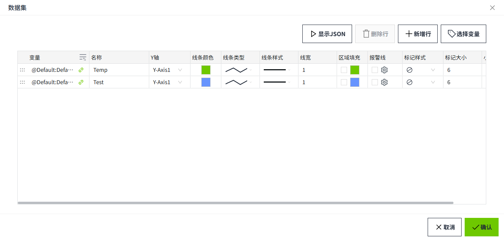
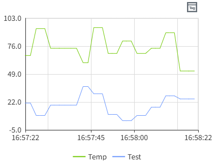
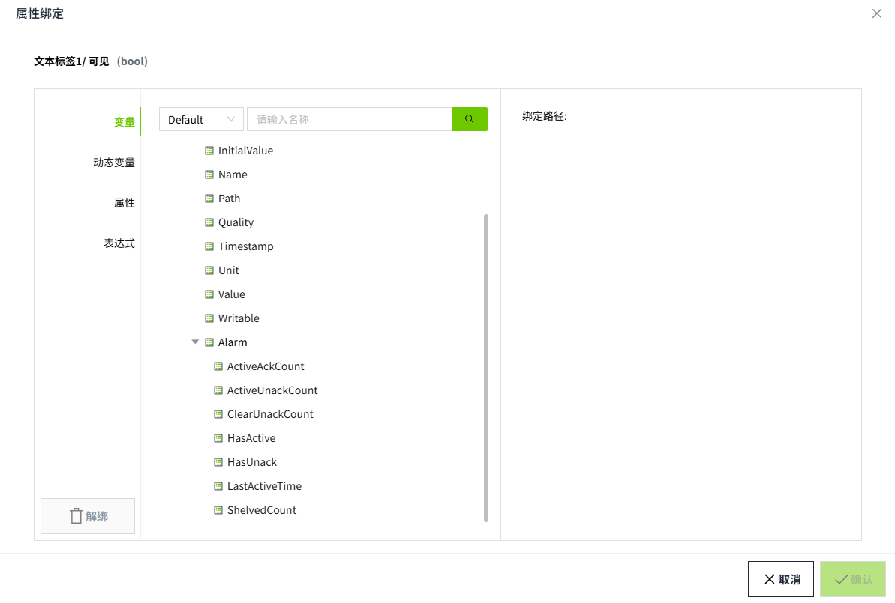

# 变量

变量绑定是将属性直接绑定到变量上，通常是值，也可以是变量的其他属性。每次所选变量的属性发生变化时，都会将新值推送到绑定的属性中。如果选择树中的变量，而不是该变量的特定属性，则认为是绑定该变量的 value 属性。

## 绑定

**示例1**

在数码管上实时显示变量的值。

1. 在画面上绘制一个数码管。

2. 将数码管的填充色设置为 6ec800，字体颜色设置为 ffffff。

3. 点击“文本”的绑定按钮。

4. 在属性弹窗中选择变量后，点击确认按钮，完成绑定。

    

    

**示例2**

在饼图上实时显示产能值。

1. 在画面上绘制实时图表。

2. 点击“数据”绑定按钮。

3. 在属性弹窗中双击变量进行选中。

    

4. 点击“选择标签”按钮选择标签。

    

    

**示例3**

在文本标签内显示变量的质量位。

1. 在画面上绘制一个文本标签。
2. 点击“文本”的绑定按钮。

    

3. 绑定变量的报警属性，查看变量当前是否在报警。true表示在报警。

    

