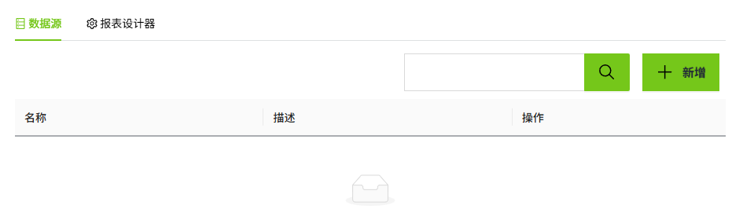
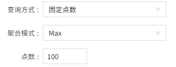

# 创建数据源

数据连接是进行所有数据分析之前的首要步骤。WAGO VC Hub 内置的报表设计器可无缝对接 VC Hub 的历史数据库以及企业的 SQL 数据库，例如 MySQL、SQLServer、Oracle 等。本章将详细介绍如何将 WAGO VC Hub 的历史变量作为报表的数据源。

1. 在创建的报表上双击鼠标，弹出设计窗口。

2. 在设计弹窗中，点击数据源列表右上角的”新增“按钮。

    

3. 在新增页面，保留所有默认值，并在以下字段中输入如下信息（说明：以下数据仅为示例，请根据实际情况填写）。

    

    - 名称：产能

    - 查询方式：原始值

    - 变量：
     区域:产能.产线1
     区域:产能.产线2
     区域:产能.产线3
     区域:产能.产线4
     区域:产能.产线5
     区域:产能.产线6

4. 单击 **“确认”** 按钮。此时该条数据将显示在数据源列表页面。

    **配置字段**

    | **名称** | **描述** |
    |:----------|:-----------------------|
    | 名称     | 数据源的名称。|
    | 描述     | 数据源的描述信息。|
    | 查询方式 | 下拉选择采样类型，包含：原始值、固定点数、周期性。当选择 **固定点数**  时，需设置 **聚合模式** 和 **点数**。      当选择 **周期性** 时，需设置 **聚合模式** 和 **周期**。    |
    | 变量     | 设置数据源所需的变量，可多选。   **说明**：只能选择开启了“历史记录”的变量。 | 

5. 切换至“报表设计器”页面，点击设置按钮。

    

6. 在报表设计器的数据源和数据集中，自动显示创建的数据源信息。

    

**说明**： 

1. 数据集仅包含3个字段： 

    - path 

    - time 

    - value 

2. 在自动创建数据源的同时，会自动为每个数据源创建两个参数：开始日期、结束日期。结束日期默认 **当天**；开始日期为 **（当前日期-7天）**。  

    

