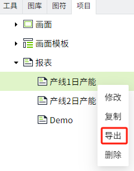

# 导出/导入报表

您可以通过报表的导出、导入功能，来实现数据的备份、恢复、共享、迁移等操作。您可以导出单个报表，也可以导出报表树的所有报表。

## 导出

**导出所有报表：** 在报表的根节点上右击鼠标，点击导出。

**导出单个报表：** 在单个报表上右击鼠标，点击导出。

**说明：**  

1. 导出的报表文件会自动存储在您电脑的“下载”目录下。 

2. 导出多个报表时，每个报表显示为一个独立的 zip 文件。

## 导入

只能在报表的根节点上右击鼠标，点击导入，完成导入操作。

**说明**：因为报表中涉及变量信息，为了确保导入到新的工程或项目后，报表能正常运行，需将变量数据也进行导入，且变量路径需完全一致。

**示例**

将报表从A工程导入B工程。

1. 在A工程的报表节点下导出一个报表：日产能。

    

2. 在资产窗口中，导出报表中使用到的变量。选择报表中变量的所属资产，点击”导出“按钮。例如：报表中使用的变量的所属资产为：产线1。

    

3. 在工程列表中打开B工程，在B工程的报表节点下，右击鼠标，点击导入，导入步骤1的报表。

4. 将报表中使用的变量导入B工程，且变量路径保持一致。

    - 在B工程的资产列表中创建一个新的资产：产线1。

    

    - 在资产窗口选择“产线1“，点击导入按钮，导入步骤2的数据。

    

5. 在报表查看器中查看导入的报表，报表可以成功显示。

