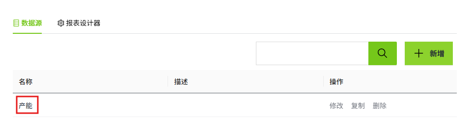

# 报表

报表是将数据以表格、图表等形式展示出来的文档。WAGO VC Hub内置了一个灵活高效的报表设计器，包含图像、图形、表格等工具，可以通过拖拽

的方式，快速地设计各种类型的报表。

您可以在“项目“窗口的报表节点上右击鼠标，单击“新增”进行创建。

报表在工业上的一些常见的应用场景如下：

- 生产效率监控：跟踪和分析生产线的效率指标，例如：产量等。
- 质量控制：记录和分析产品质量相关数据，例如：不良率等。
- 设备维护：记录和分析设备的维护情况，例如：停机时间等。
- 库存跟踪：监控和优化物料和零部件的库存情况。例如：
- 能源消耗分析：记录和分析能源消耗情况，例如：电力、水、燃气等。
- 成本分析：分析和管理生产过程的成本，例如：人工成本、原材料成本等。

以下流程图，可以帮助您快速了解报表的使用流程，希望能为您带来帮助。

## 数据源自动创建

在报表中创建数据源后，打开报表设计器，该报表的所有数据源自动添加到报表设计器中。

**报表的数据源：**

**报表设计器内显示的数据源：**

## 强大的报表设计器

[报表设计器](report-designer/index.md) 提供了开发多种报表样式的能力，并通过内置的丰富的报表控件，如表格、矩表、图表等控件，帮助用户轻松设计多种报表样式。

## 独立的报表查看器

可以在“[报表查看器](../controls/table/report-viewer.md)”中查看已设计完成的报表。

## 支持多种文件格式

在报表查看器中，点击“导出”按钮，可以选择期望导出的文件格式。

支持的文件格式如下：

- Excel(*.xlsx)
- Word(*.docx)
- PDF(*.pdf)
- CSV(*.csv)
- JSON(*.json)
- XML(*.xml)
- 图像(*.tiff)
- WEB电子邮件档案(*.mht)

