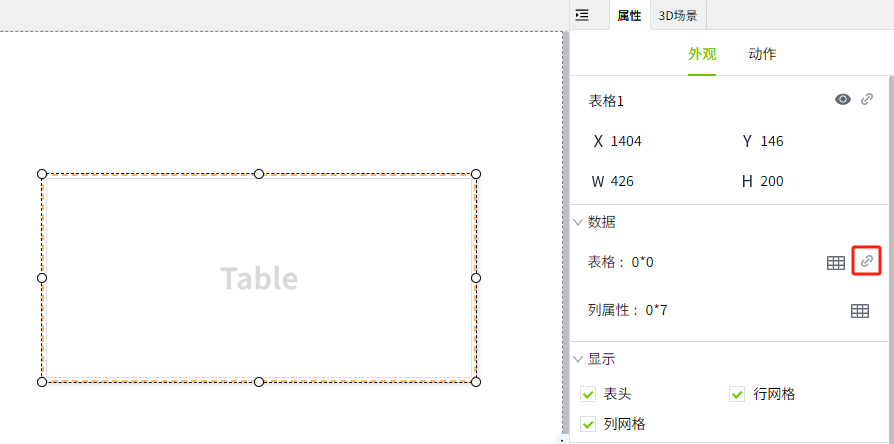

# SQL Query

## 什么是 SQL Query ？

SQL Query是预先创建好的查询，可以在项目中的多个地方调用。执行 SQL Query 时，您可以传递参数来获取动态结果集，从而避免重复编写查询代码。

SQL Query有三种查询类型：

1. **Query**：这是最常见的查询类型，通常用于从数据库中检索数据，执行 SELECT 语句并返回完整的结果集。在运行返回多行或多列的 SELECT 语句时，应选择此类型。
2. **Scalar Query**：用于返回单一值，不再返回多个行和列，而是返回第一列第一行的单个值。此类型很特殊，因为可以定义 **Fallback** 值。如果执行出错，则将返回 Fallback 值。
3. **Update Query**：用于修改数据库中现有的数据。通过传递参数指定要更新的表格和字段，并根据条件（如 WHERE 子句）更新匹配的数据行。此查询不会返回数据，而是直接影响数据库内容。

SQL Query位于编辑器的“项目“>“数据请求“下。

## 在哪里使用 SQL Query？

SQL Query可以在多个地方使用。以下是可以使用 SQL Query 的一些示例。

1. 属性绑定。目前仅 Table 控件，在进行数据绑定的时候，支持绑定 SQL Query。具体请见 [表格](../controls/table/table.md)。

    

    可以绑定一个已经创建的 SQL Query。可以将查询结果作为table的数据集，显示在 table 控件上。

    

2. 脚本

    [System.Db.runSqlQuery ](../../appendix/system-function/system-db/system-db-runsqlquery.md)函数可用于从任何脚本调用 SQL Query。

    

