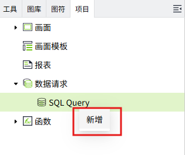
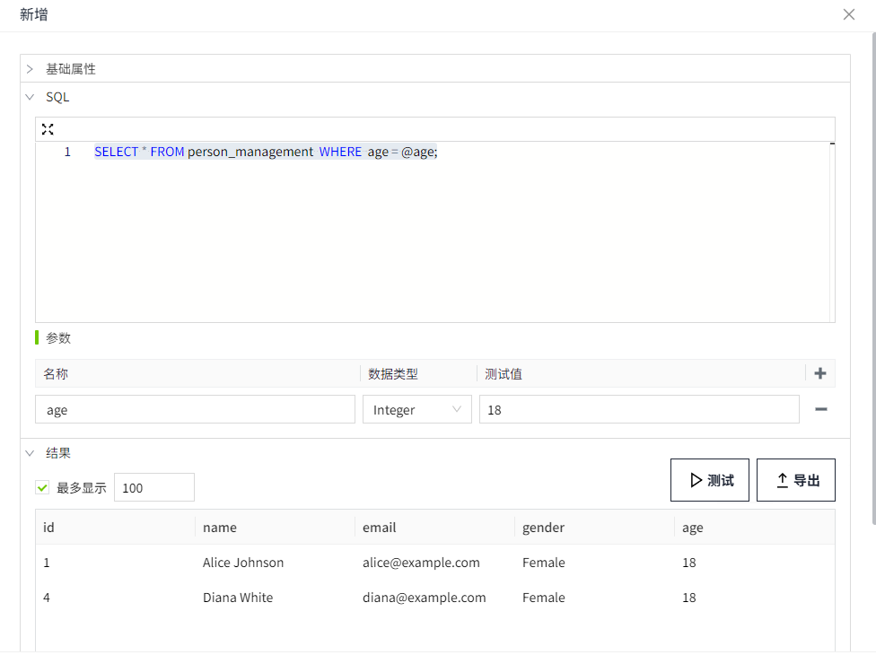
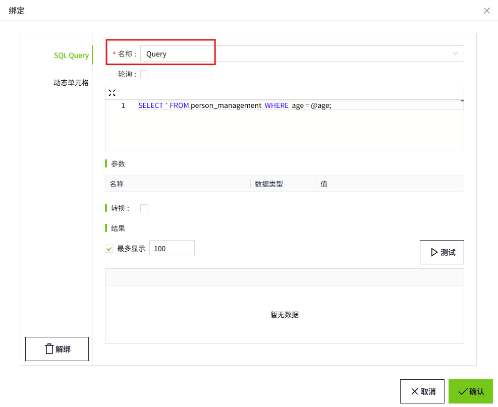
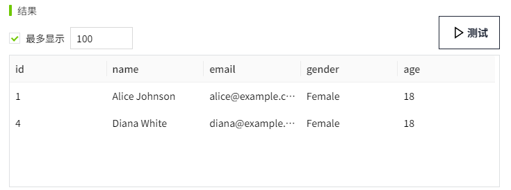
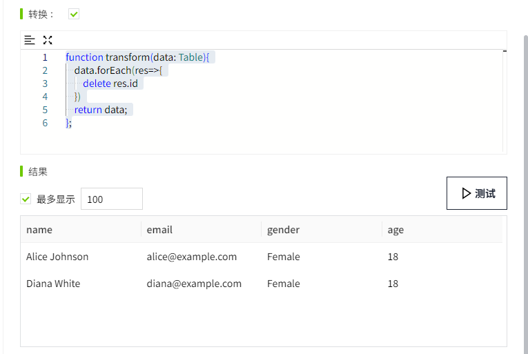

# Query

## 场景举例

按照用户输入的年龄，在数据库中查询对应人员，并通过表格显示查询结果。

## 步骤

#### 创建数据库连接

在 “数据库”->“数据库连接” 页面，新建一个数据库连接,名称为 **TestSQLQuery**。具体步骤请参考 [数据库连接](../../../management-platform/databases/database-connection/index.md)。


数据库中存在表 `person_management`，该表用于记录人员的信息，其结构如下。

| Id | name          | email               | gender | age |
|:----|:---------------|:---------------------|:--------|:-----|
| 1  | Alice Johnson | `alice@example.com`   | Female | 18  |
| 2  | Bob Smith     | `bob@example.com`     | Male   | 19  |
| 3  | Charlie Brown | `charlie@example.com` | Male   | 19  |
| 4  | Diana White   | `diana@example.com`   | Female | 18  |
| 5  | Edward Green  | `edward@example.com`  | Female | 20  |

#### 创建SQL Query

1. 创建项目，在操作栏点击项目的 **设计** 按钮，进入编辑器。
2. 在编辑器的 “项目” 窗口的 SQL Query 节点上，单击鼠标右键，选择新增，创建一个 SQL Query。

    

3. 在此示例中，我们将该 SQL Query 的名称设置为 **Query**。

    

    - **数据库连接：** 选择一条在”数据库“->"数据库连接"列表中状态为”已连接“的数据。在此我们选择步骤1中已经创建的 **TestSQLQuery**。

    - **查询类型：** 选择 **Query**。

    - **SQL编辑器：** 编写如下查询语句，该语句根据age的值，在 `person_management` 表中进行查询匹配数据。其中 @age表示参数。

        ```sql
        SELECT * FROM person_management  WHERE 	age = @age;
        ```
    
    - **参数：** 创建一个名称为age的参数。在SQL语句中充当占位符，在执行查询时，您可以为其传递具体的值。

4. 点击“测试”按钮，查看结果。

    

#### 使用Query

1. 在设计页面的 **工具** 窗口中找到 **表格** 控件，拖动到画面中。

    

2. 选中表格控件，在属性栏中，点击“表格”属性的绑定按钮，为其绑定一个 SQL Query。

    

3. 选中 **SQL Query** 后，在 **名称** 下拉框中选择刚刚创建的数据 **Query**。

    

4. 点击参数 "age" 的绑定按钮，

    

    弹出属性绑定窗口，将其绑定到数字输入框的value属性。当数字输入框输入不同的数值时，按照不同的年龄进行查询。

    

5. 转换功能支持对查询到的数据再次进行新增、修改或删除列。

    点击测试按钮后，结果如下。

    

    如果我们想隐藏id列，可以在转换中，编写如下脚本。

    ```typescript
    function transform(data: Table){
        data.forEach(res=>{
            delete res.id
        })
        return data;
    };
    ```
 
6. 再次点击测试按钮，在结果列表中，将不再显示 **id** 列。

    

7. 最后，我们要确保轮询模式设置为 **关闭**。这意味着查询不会连续运行，而只会在参数发生变化时运行，例如在数字输入框内输入了新值。

    

8. 点击 “确定” 按钮完成绑定，并点击画面的预览进行测试。在预览画面的 “数字输入框” 中输入要查询的年龄，即可检索匹配的数据，并将查询结果显示在表格中。

    

