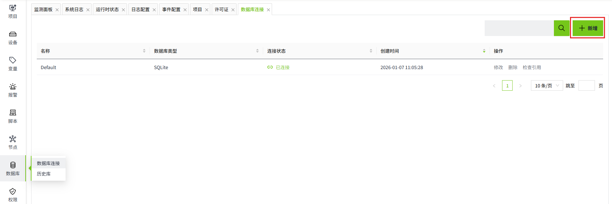
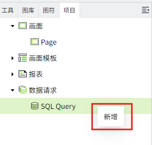
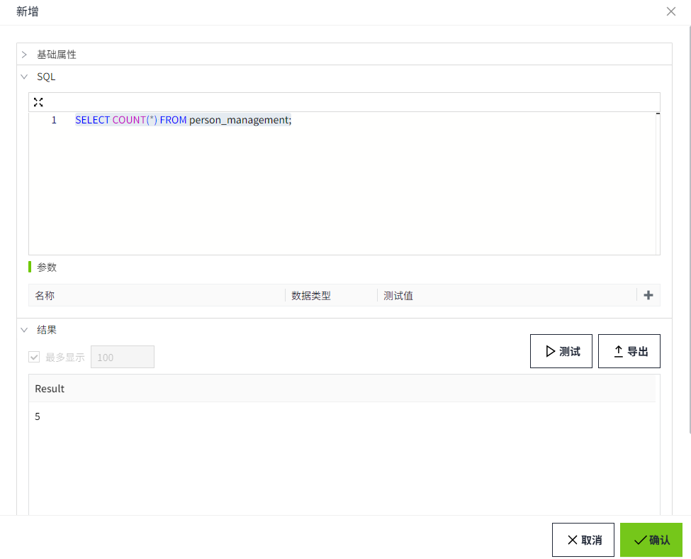

# Scalar Query

## 场景举例

在数据库中查询总人数，并在画面上显示查询结果。

## 步骤

#### 创建数据库连接

在”数据库“->"数据库连接"页面，新建一个数据库连接，名称为 **TestSQLQuery**。具体步骤请参考 [数据库连接](../../../management-platform/databases/database-connection/index.md)。



数据库中存在表 `person_management`，该表用于记录 `人员` 的信息，其结构如下。

| Id | name          | email               | gender | age |
|:----|:---------------|:---------------------|:--------|:-----|
| 1  | Alice Johnson | `alice@example.com`   | Female | 18  |
| 2  | Bob Smith     | `bob@example.com`     | Male   | 19  |
| 3  | Charlie Brown | `charlie@example.com` | Male   | 19  |
| 4  | Diana White   | `diana@example.com`   | Female | 18  |
| 5  | Edward Green  | `edward@example.com`  | Female | 20  |

#### 创建SQL Query

1. 创建项目，在操作栏点击项目的 **设计** 按钮，进入设计页面创建并打开画面。
2. 在 “项目” 窗口的 SQL Query 节点上，单击鼠标右键，选择新增。

    

3. 在此示例中，我们将该 SQL Query 的名称设置为 **ScalarQuery**。

    

    - **数据库连接：** 选择一条在 “数据库”->“数据库连接” 列表中状态为 “已连接” 的数据。在此我们选择步骤1中已经创建的 **TestSQLQuery**。

    - **查询类型：** 在这个例子中，执行结果返回一个值，因此我们选择 **Scalar Query**。

    - **回退值：** 如果 SQL 语句执行失败返回的数据。

    - **SQL编辑器：** 编写如下查询语句，查询 `person_management` 表中的总人数。

        ```sql
        SELECT COUNT(*) FROM person_management;
        ```
 
4. 点击 “测试” 按钮，查看结果。

    

## 使用Scalar Query

1. 在设计页面的 **工具** 窗口中找到 **文本标签** 和 **按钮** 控件，拖动到画面中。

    

2. 选中按钮控件，点击箭头指的图标，打开动作的配置页面。

    

3. 为按钮配置 **鼠标按下** 事件，每次点击按钮时查询总人数，并将结果显示在文本标签控件中。

    

    ```typescript
    // 查询总人数
    const result = await System.Db.runSqlQuery('ScalarQuery');
    // 获取文本标签
    const label = await System.UI.findControl('文本标签1');
    //修改文本标签内容
    label.text = `表格总人数：${result}`;
    label.applyChanges()
    ```
 
4. 点击画面的预览按钮，在预览页面按下按钮，查询总人数。

    

