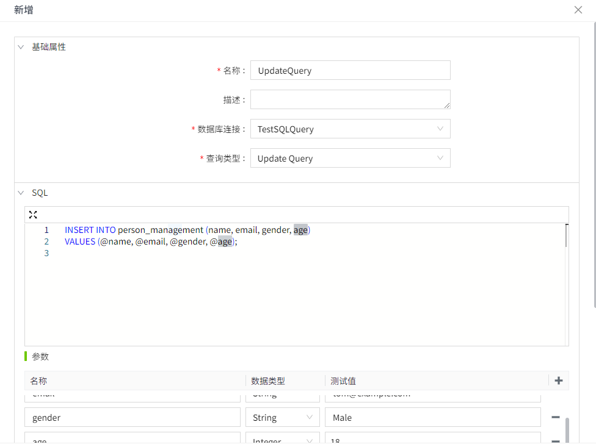
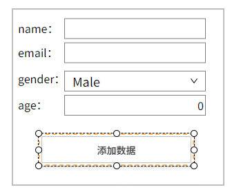
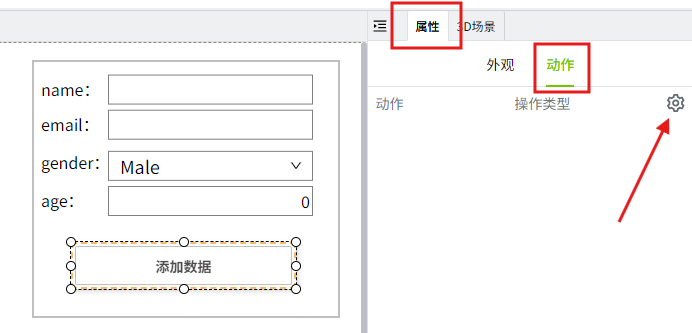
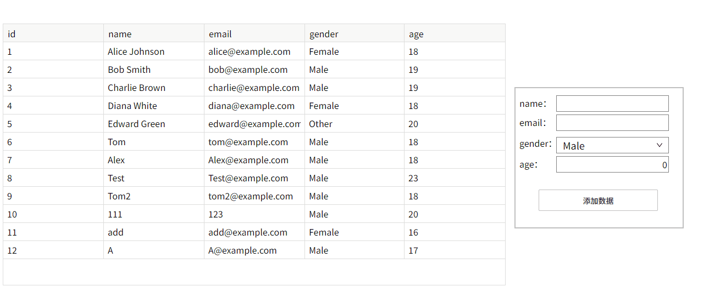

# Update Query

## 场景举例

向数据库中新增数据。

## 步骤

#### 创建数据库连接

在”数据库“->"数据库连接"页面，新建一个数据库连接,名称为 **TestSQLQuery**。具体步骤请参考 [数据库连接](../../../management-platform/databases/database-connection/index.md)。


数据库中存在表 `person_management`，该表用于记录 `人员` 的信息，其结构如下。

| Id | name          | email               | gender | age |
|:----|:---------------|:---------------------|:--------|:-----|
| 1  | Alice Johnson | `alice@example.com`   | Female | 18  |
| 2  | Bob Smith     | `bob@example.com`     | Male   | 19  |
| 3  | Charlie Brown | `charlie@example.com` | Male   | 19  |
| 4  | Diana White   | `diana@example.com`   | Female | 18  |
| 5  | Edward Green  | `edward@example.com`  | Female | 20  |

#### 创建SQL Query

1. 创建项目，在操作栏点击项目的 **设计** 按钮，进入编辑器。
2. 在编辑器的 “项目” 窗口的 SQL Query 节点上，单击鼠标右键，选择新增，创建一个 SQL Query。

    

3. 在此示例中，我们将该 SQL Query 的名称设置为 **UpdateQuery**。

    

    - **数据库连接：** 选择一条在”数据库“->"数据库连接"列表中状态为”已连接“的数据。在此我们选择步骤1中已经创建的 **TestSQLQuery**。

    - **查询类型：** 在这个例子中，我们要更新表的数据，因此选择 *Update Query**。

    - **SQL编辑器：** 编写如下查询语句，该 SQL 语句通过参数给 `person_management` 表新增记录。

        ```sql
        INSERT INTO person_management (name, email, gender, age) 
        VALUES (@name, @email, @gender, @age);
        ```
    
        **参数：** 在 SQL 语句中充当占位符，在执行查询时，您可以为其传递具体的值。

        

4. 点击“测试”按钮，可以看到 Result 返回数据1，代表执行成功，影响了一行数据。

    **注意**：通过测试按钮执行 **Update Query** 类型的语句，也会真正修改数据库内容。 

    

#### 使用Update Query

1. 在设计页面 **工具** 窗口中，添加 4 个文本标签，2 个文本输入框，1 个下拉框，1 个数字输入框，1 个按钮到画面中。

    

组成如下一个简单的添加数据页面。

    

2. 选中按钮控件，点击箭头指的图标，打开动作的配置页面。

    

3. 为按钮配置**鼠标按下**事件，每次点击按钮时获取输入框和下拉框的值，将值添加到数据库中。

    

    ```typescript
    // 获取name
    const nameValue = System.Page.getPropertyValue('nameInput#text')
    // 获取email
    const emailValue = System.Page.getPropertyValue('emailInput#text')
    // 获取gender
    const genderValue = System.Page.getPropertyValue('genderDropdown#selectedValue')
    // 获取age
    const ageValue = System.Page.getPropertyValue('ageInput#value')
    //如果有任意值不存在就返回
    if (!nameValue || !emailValue || !genderValue || !ageValue) {
        return;
    }
    //执行脚本
    const result = await System.Db.runSqlQuery('UpdateQuery', [
        {
            name: 'name',
            value: nameValue
        },
        {
            name: 'email',
            value: emailValue
        },
        {
            name: 'gender',
            value: genderValue
        },
        {
            name: 'age',
            value: ageValue
        },
    ])
    // 如果执行成功清空值
    if (result) {
        // 清空name
        System.Page.setPropertyValue('nameInput#text', '')
        //清空email
        System.Page.setPropertyValue('emailInput#text', '')
        // 清空gender
        System.Page.setPropertyValue('genderDropdown#selectedValue', 'Male')
        // 清空age
        System.Page.setPropertyValue('ageInput#value', '')
        // 表格重新查询数据
        const table = await System.UI.findControl('表格2')
        table.reload()
    }
    ```
 
4. 点击画面的预览按钮，在预览页面按下按钮，为数据库添加数据。新增数据后，表格将重新加载，并显示新增的数据。

    

