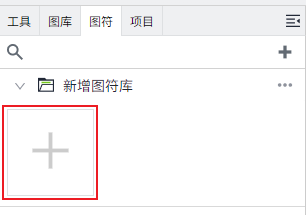
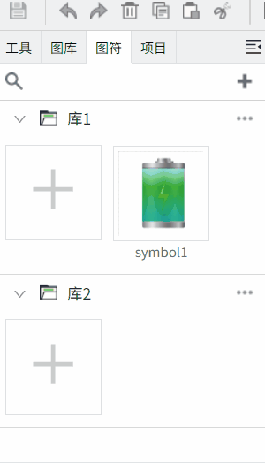

# 创建图符

您可以在“图符编辑器”中创建图符。图符只要创建一次，即可以作为一个模板，然后在画面中创建多个模板实例。每个实例拥有相同的组件和属性，但是数据是可以不同的。在模板上发生的任意变化，在图符实例中都会自动更新。

## 新增图符

您可以展开一个图符库，点击库内的新增按钮，弹出新增窗口，设置图符的名称，点击确认按钮创建图符。

创建完成后，会在编辑器上显示一个空的图符窗口。图符窗口的背景色默认透明。您可以根据需要设置背景色。

**属性**

| **名称**   | **描述**  |
|:------------|:--------|
| W          | 图符的宽度，单位px。|
| H          | 图符的高度，单位px。 |
| 背景       | 图符的背景色，支持 [属性绑定](../property-binding/index.md)。    |
| 自定义属性 | 您可以像使用任何其他属性一样使用自定义属性。   要配置自定义属性，请执行以下操作：   1. 点击图符编辑器的空白处。  2. 点击“外观”>“自定义属性”。  3. 单击加号图标以添加一行。  4. 输入自定义属性名称、数据类型、初始值。  5. 添加后自定义属性自动保存。    |

**说明**：图符支持嵌套，可以将一个图符嵌到另一个图符内，但不能嵌套自身。

**如何查看图符窗口属性**

1. 点击图符编辑窗口的空白处
2. 点击图符窗口对应的 Tab 页名称

3. 点击图符编辑窗口之外的灰色区域，下图红框内区域。

## 编辑图符

和绘制画面的方法相同，在图符窗口中添加组件（如：控件，图片，图符）。一旦更改图符，该图符的所有实例都会更新。

当您的图符创建完成，可以通过以下4种方式打开图符进行编辑：

- 方式1：双击“图符库”中的图符，会在编辑器上自动打开该图符的编辑窗口；
- 方式2：右击图符，在弹出的菜单中点击“编辑”按钮。

- 方式3：在画面上，双击图符，会自动打开图符编辑窗口。
- 方式4：在编辑器中，右击选中该图符的实例，在弹出菜单中选中“编辑”按钮来打开图符。

## 另存**图符**

当图符创建完成后，点击画面菜单中的“另存为”按钮，设置需要存放的图符库以及图符名称完成创建。

## 移动图符

您可以通过拖拽的方式改变图符的所属图符库。要将图符移动到其他图符库，请点击该图符并拖动鼠标，将其移动到目标库内释放鼠标即可。

**注意**：如果图符是已打开的状态，您不能执行移动图符的操作。

## 复制/粘贴图符

在图符库中右击图符，点击**复制**选项，可以对图符进行复制。

复制后，点击图符库的...进行粘贴。

## 实例图符

图符创建完成后，您可以拖动图符到画面或画面模板上创建多个图符实例。实例创建完成后可以像其他控件一样操作其属性。

**实例后的图符属性**

| **名称**   | **描述** |
|------------|---------------|
| 名字       | 此图符实例的名称。|
| X          | 图符实例左侧距画布左侧的距离，单位px。 |
| Y          | 图符实例顶部距画布顶部的距离，单位px。|
| W          | 图符实例的宽度，单位px。 |
| H          | 图符实例的高度，单位px。 |
| 路径       | 图符实例的完整路径。 |
| 自定义属性 | 和图符设置的自定义属性一致，可点击绑定按钮设置 [属性绑定](../property-binding/index.md) |

