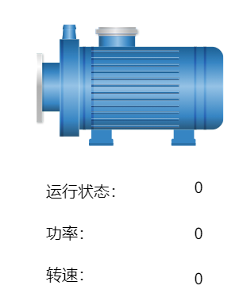

# 应用图符

## 示例 1：使用间接标签绑定管理多个电机

**场景**：假设存在3个相同配置的电机，每个电机都有“运行状态”、“功率”、“转速”这3个变量，我们希望使用一个图符来显示这些电机的状态时，动态变量绑定可以帮助我们实现这一目标。

这些变量路径分别为：

`@区域:电机1.运行状态`

`@区域:电机1.功率`

`@区域:电机1.转速`

`@区域:电机2.运行状态`

`@区域:电机2.功率`

`@区域:电机2.转速`

`@区域:电机3.运行状态`

`@区域:电机3.功率`

`@区域:电机3.转速`

1. 在“图符”窗口，创建图符库：库1。
2. 点击该图符库的新增按钮，添加一个名为“电机”的图符。
3. 在图符编辑窗口添加一个电机图片；添加3个文本标签控件，分别命名为：运行状态、功率、转速；添加3个值显示控件，放在文本标签后方，用于显示对应值。绘制效果如下：

      

4. 点击图符窗口的空白处，为图符添加如下自定义属性。

      

5. 在图符上
      - 将 **运行状态** 后面的值显示控件的文本属性绑定到图符的自定义属性：**运行状态**。

      - 将 **功率** 后面的值显示控件的文本属性绑定到图符的自定义属性：**功率**。

      - 将 **转速** 后面的值显示控件的文本属性绑定到图符的自定义属性：**转速**。

6. 在”画面1“上添加电机的实例，一个文本标签和一个下拉框。文本标签的内容设置为”电机：“，下拉框配置如下：

      

7. 在画面上，点击图符实例，为其绑定属性，通过所选的下拉框的值，来显示对应电机的参数。

      - 在其属性中点击“**运行状态**”的绑定按钮，为其绑定如下动态变量。

      

      - 在其属性中点击“**功率**”的绑定按钮，为其绑定如下动态变量。

      

      - 在其属性中点击“**转速**”的绑定按钮，为其绑定如下动态变量。

      

8. 在运行页面，切换下拉框的值，查看图符上显示的参数值。

      

**示例2：假设您有一个泵，您希望使用图符来显示泵的运行状态。如果泵在运行，图符显示为绿色；如果泵停止，图符显示为红色。**

1. 在“**图符**”窗口，创建图符库：**库1**。

2. 点击该图符库的 **新增** 按钮，添加一个名为“**指示灯**”的图符。

3. 在图符编辑窗口添加一个圆形，用来表示泵运行状态的指示灯。

4. 点击图符的空白处，为图符添加一个名为 **Color** 的自定义属性。

      

5. 点击圆形的填充色的 **绑定按钮**，将其绑定到图符的自定义属性 **Color**上。

      

6. 在画面上添加该图符，点击图符，在其在定义属性中点击 **Color** 属性的 **绑定按钮**，为其绑定一个表达式，当变量值为真时，显示绿色，当变量值为假时，显示红色。其中变量：**区域:指示灯** 表示设备的指示灯的状态，是个布尔型变量。

      

7. 运行画面，查看图符显示效果。

      

