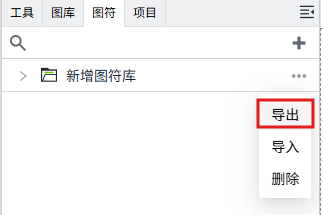

# 图符库

在”图符“窗口中对图符进行管理。

## 新增图符库

点击图符右侧的新增按钮进行添加，点击后会自动创建一个图符库， 默认名称为：`新建图符库`。

新建成功后，库名处于编辑状态，您可以对其名称进行修改。若您需要再次修改，双击图符库名称，即可进入编辑状态。

## 导出图符库

点击图符库右侧的`...`按钮，在弹出菜单中点击“导出”按钮，可以将此图符库下的所有图符文件导出。

在导出窗口中，您可以手动选择需要导出的图符文件。

## 导入图符库

在图符库后点击`...`图标，在弹出菜单中点击“导入”按钮，可以将已导出的文件导入到当前图符库下。

## 删除图符库

在图符库后点击`...`图标，在弹出菜单中点击“删除”按钮，会将此库下所有图符全都删除。

此时会显示一条确认消息，点击“确认”按钮完成删除操作。

如果库下的图符已被使用，则库被删除后，使用了该库下图符的画面在运行页面，对应的图符将显示为破裂的图片，表示内容丢失。

