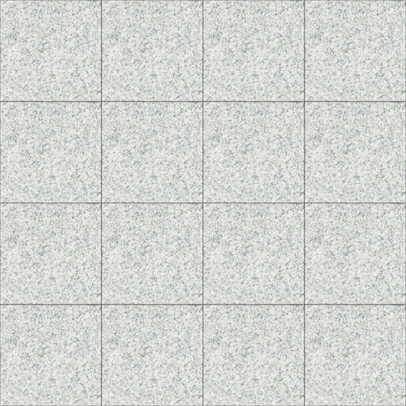

# 材质与贴图

### 材质设置

模型材质为：通用 —物理材质（VC Hub环境对材质没有要求，通用材质为图里材质，如有需求可自行选择）。

例如墙、地面等没有反光的材质，需要把反射值设置为0，不然导入VC Hub环境会有反光。  

### 贴图标准

一、大小、格式要求。

1.  贴图大小：比例尽量为 1：1 的正方形。大小为 2 的 n 次方，例如 128X128。最小尺寸不低于 32X32，最大尺寸不超过 2048X2048。

2.  贴图格式采用 JPG 格式，透明贴图采用 PNG 格式。

3.  命名规范：

    - 贴图的名称不要全是数字，以汉字和数字搭配使用，方便分类查找。

    - 不要有特殊符号和空格，名称和后缀以下划线间隔。

    - 贴图名称不要重复，如果一个模型需要用到两种及以上贴图，名称为“模型名称 + 数字命名”如：房屋_01,房屋_02。

二、贴图用法和重复性

1. 模型应该使用贴图的部分

    模型面板、按键、指示灯等用贴图表现。   

    

2. 栏杆，网状模型以透贴贴图表现，节省模型资源。

    

3.  如果一张贴图出现多个相同且重复元素，应该把贴图简化为最简单的元素。

    例如：以下地砖贴图为连续重复贴图，只用取其中一块使用即可。

    
   

三、贴图使用规则

1.  在使用贴图时，一个模型尽量使用一张贴图。如果模型需要的贴图不止一张，尽量把所有的贴图整合到一张内。

    

2.  贴图在赋予模型时，避免拉伸，保证模型UV正确。

    如下图所示

    

