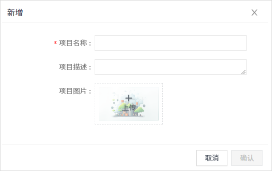
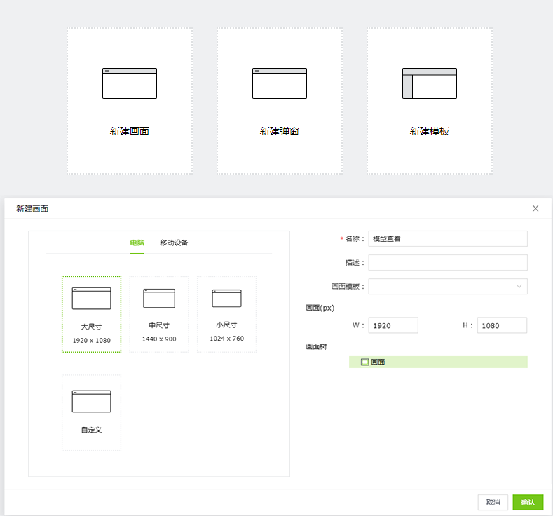
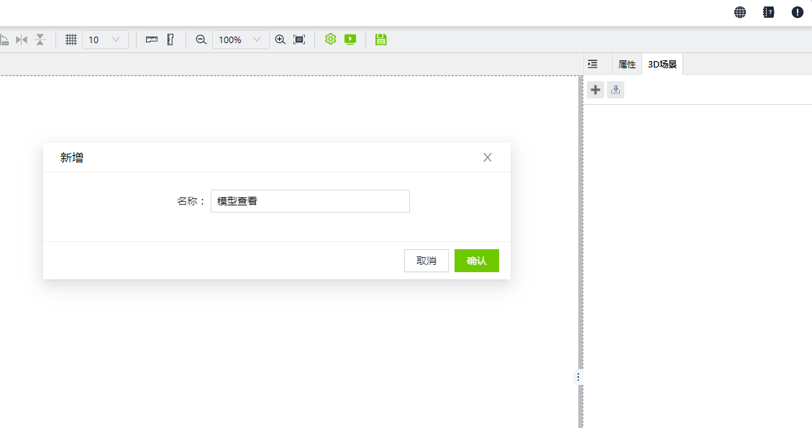
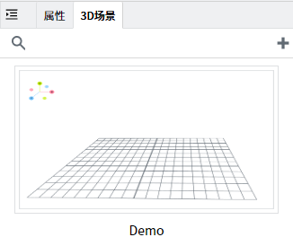

# 模型导入VC Hub

#### 根据以下图片提示依次操作

**第一步：** 在项目列表，点击新增按钮，输入项目名称，点击”确认”按钮。

**第二步：** 新增完成后点击项目的设计按钮。

**第三步：** 点击新建画面按钮，选择需要的尺寸，输入项目名称之后确认。

!

**第四步：** 在“3D场景”窗口，点击➕号按钮，添加场景。

**第五步：** 双击新建好的场景。

**第六步：** 点击模型库的➕按钮，添加本地模型库。

**第七步：** 在模型库内上传模型。

**第八步：** 添加完成后双击模型，将其添加至编辑器中，选择不缩放添加至场景。

**第九步：** 场景默认有环境光和平行光，如有需要可多次添加所需灯光。若出现图片中模型显示黑色状况，可手动添加光源，

下方图片红框内为需要添加的灯光。点击左上角结构按钮，可查看场景内添加的模型与灯光。

添加光源后查看模型显示效果。

