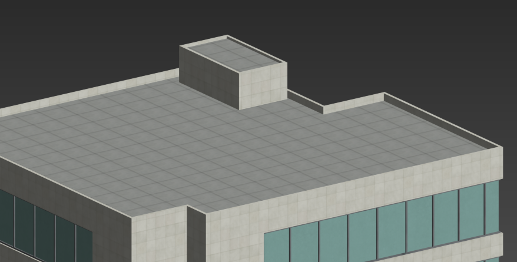

# 建模标准及注意事项

### 软件单位设置

模型制作单位默认为CM，单位设置需和系统单位统一。

### 模型中心轴设置

1. 摆放在地面，平面上的模型设置。

    需要把中心轴放在模型的最底部的同时并保持在模型最中心。用X,Y,Z轴来解释为，把X,Y轴为物体最中心，Z轴为物体最底部。这样在轴归零时模型会保持在软件最中心，导入在VC Hub使用时方便编辑。   

    

2. 摆放在墙壁或紧贴其他物体的模型设置。

    需要把模型轴设置到贴合位置的最外边，依据具体模型摆放情况而定。例如摆放在桌面上的显示器鼠标键盘，需要把坐标轴设置到最底部，与桌面紧贴。

    

    安装在墙面的模型需要把轴设置到模型的最侧边，接触面与墙面紧贴。

    

    如果没有正确设置，缩放时会导致模型穿模 。

### 模型制作对面的要求和控制

1. 多边面问题。

    模型制作过程中尽量采用四边面，避免出现大于四边的多边面。

    因为在模型导出的时候，软件会把所有多边面计算分成三边面，多变面比四边面会多出许多三边面，造成资源浪费。

2. 模型布线合理 。

    同样在模型表面制作一个凹槽，左边模型合理布线面为28，右边模型面数为36。

    

3. 模型面数精简。

    制作过程中，在保留模型结构的的基础上尽可能优化多余边面，左边为模型高模，右边为低模。

    

4. 拆分，穿插模型。

    制作模型时，将一个模型拆分成两个结构，比直接在模型上制作此结构，面数会少很多。

    

    

    上方 为穿插制作方式，下方为不穿插制作。

5. 控制模型分段。 

    以圆柱形模型示例，由小到大控制模型分段，从而控制面数。

    

    模型大小所对应边数参考 

    - 直径5厘米左右的圆柱，分段为6边

    - 直径10厘米左右的圆柱，分段为8边

    - 直径20厘米左右的圆柱，分段为10边

    - 直径30厘米左右的圆柱，分段为12边

    （可以根据模型细节要求酌情适当加减边数）   

6. 用贴图代替结构

    比如操作面板。

    

    使用透明贴图代替椅子靠背网布的结构

    

7. 看不到的面和接触面需要删除。

    

### 比例正确和简单效果

1. 模型整体比例和实际照片一致。
2. 模型细节间距比例正确。
3. 模型各部分和整体占比协调。
4. 并排贴紧摆放且方正的模型需要制作倒角，倒角后摆放更加真实 。

    

    

### 注意事项（主要为建筑模型）

1. 建筑内部。

    室内踢脚线不需要单独制作模型，用贴图来体现即可。

    

    门高一般为2.1米

    

    一般情况下，天花板和灯是不用制作的。如果有需求，可以制作。 

    

2. 建筑外部。 看不到的面以及穿插在模型内部的面需要删除

    

    如果只需要从外部查看模型，建筑外墙只需要制作单面即可，不用带厚度。如下图所示左边错误，右边正确。

    

    若没有明确标示建筑顶部结构时，需要为顶部制作女儿墙。尺寸一般为宽30CM,高50CM，三层以下高为30CM。

    

3. 建筑高度如果有图纸和明确标示按照尺寸来制作。如果没有图纸，按照每层3米制作。需要注意的是如果建筑的第一层是商铺，第一层为4-5米高。

## 模型最终检查（检查部分包含：废点、废线、废面、漏面漏缝、多边面、反转面问题）

  <!-- 左列 -->
  

    

      
1. 废点示例

      

        
      

    

    

      
3. 废面示例

      

        
      

    

    

      
5. 多边面示例

      

        
      

    

  

  <!-- 右列 -->
  

    

      
2. 废线示例

      

        
      

    

    

      
4. 漏面漏缝示例

      

        
      

    

    

      
6. 面反转示例

      

        
      

    

  

