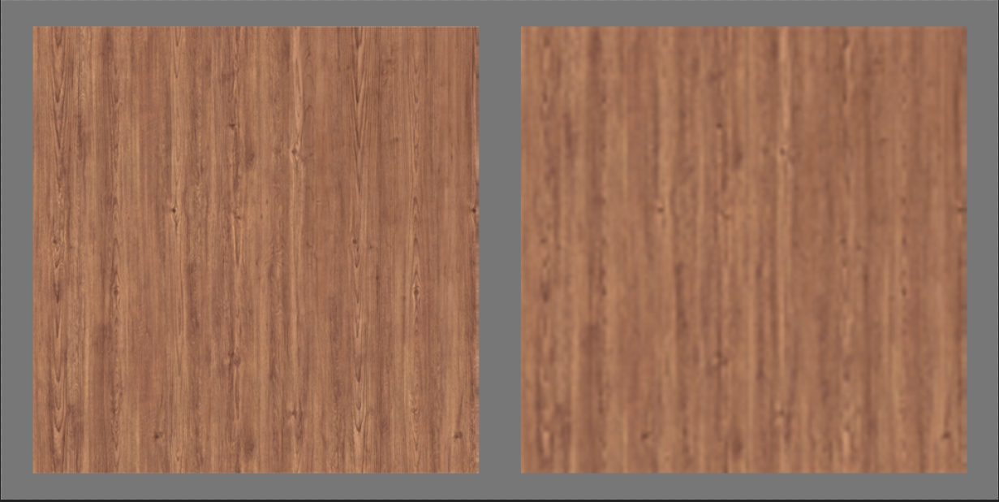

# 导出前的检查

### 主要检查项

1. 单位设置和系统单位设置一定要保持一致。

      

2. 命名无特殊符号。
3.  模型轴设置正确且在软件中心

      一般情况下，摆放在地面的模型坐标轴在最底部，摆放在天花板的模型坐标轴在模型顶部，如果模型放在墙面视具体情况而定。需要注意的的是，不论模型坐标轴怎么设置，模型一定是在软件的世界中心。

      （设置正确的中心点，方便后续在使用中的移动、缩放。）

4.  模型面数合理

      在保持模型大型且贴图不拉伸的情况下尽可能减少模型面数。

      （减面优化可以把贴图赋予模型，根据贴图会不会拉伸去优化模型）

      

5. 检查布线是否合理。
6. 去除无用的点、线、面。

### 材质检查

检查材质是否给出了合理的数值，主要是反射值。

玻璃金属类模型需要有反射值，反射值为 1 。相对的墙面地面不能有反射值，反射值为 0 。

### 模型外观检查

1.  检查模型比例，对比资料查看模型的比例，大小。

      如下图所示，模型比例与实际比例不一致，就会造成强烈的不真实感。

      

2. 模型的平滑度。

      左边的模型平滑正确，模型看着很顺滑。右边模型平滑设置错误，模型看着会有棱角感。

      

3. 检查模型尺寸。

      主要检查模型长、宽、高是否和提供资料一致。依据具体使用场景和需求，模型细节是否达标。

      检查方法为：例如一个正常办公桌子的尺寸为长145CM，宽60CM，高75CM，可以新建一个此尺寸的Box和模型重合，就可以检查模型尺寸是否对。

      

4.  检查模型是否有结构的缺失。

      根据提供图片查看模型还原度是否达标，是否有缺少模型结构未制作。

### 贴图检查

1.  命名检查。 贴图命名是否和模型对应，是否有特殊符号。
2.  贴图有无丢失。 检查材质是否有丢失状况，如果丢失会出现导出模型没有相对应材质赋予，导出后会显示出错。贴图丢失一般是存储贴图的位置改变或者删除，需要重新赋予。
3.  检查贴图清晰度。 在保证贴图清晰度的情况下，尽可能的缩小尺寸。不能为了优化资源减少贴图大小，无限制缩小贴图。  

      如下图所示：左侧为贴图清晰，右侧为贴图模糊。

      

4.  贴图UV是否正常。

      检查贴图UV是否存在拉伸，形状是否合理，比例是否正确。贴图UV显示不正确，会存在拉伸模糊，比例不正确，影响视觉效果。

      

