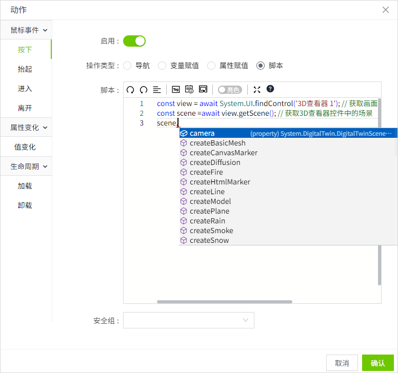

# getScene

**描述:** 获取3D查看器中的3D场景，获取到的返回值可以使用场景操作中的所有方法

```typescript
const view = await System.UI.findControl('3D查看器1'); // 获取画面中名为“3D查看器1”的3D查看器控件
const scene =await view.getScene(); // 获取3D查看器控件中的场景
```
 


