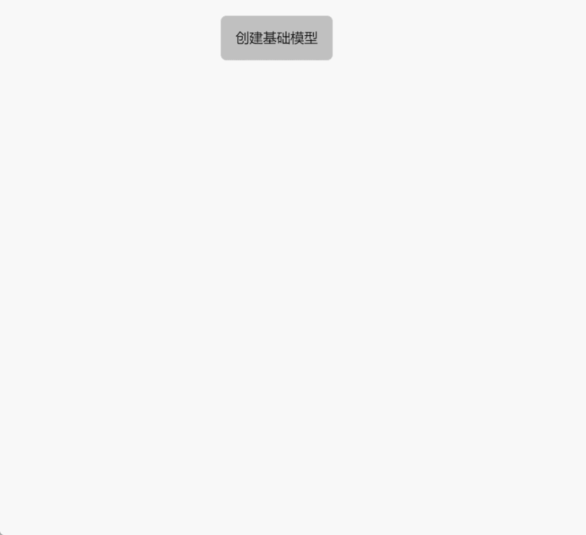

# createBasicMesh

**描述：** 创建基础模型进入场景中(包含正方形,圆形,圆柱形,圆环)

```typescript
const view = await System.UI.findControl('3D查看器1'); // 获取画面中名为“3D查看器1”的3D查看器控件
const scene = await view.getScene(); // 获取3D查看器控件中的场景
scene.createBasicMesh({
    type: 'Box',   //模型的类型支持 "Box" | "Sphere" | "Cylinder" | "Torus"
    name: 'Box',   //创建后的名字
    color: '#6ec800',  //创建的颜色
    position: { x: 0, y: 0, z: 0 }, // 初始位置 默认0,0,0
    rotation: { x: 0, y: 0, z: 0 }, // 初始旋转角度 默认0,0,0
    size: [5, 5, 5] // 初始大小 
    // Box      默认 [5, 5, 5]         => [宽度, 高度, 厚度]
    // Sphere   默认 [3.5, 15, 15]     => [球体半径, 横向切分数, 纵向切分数]
    // Cylinder 默认 [2, 2, 15, 20]    => [上底半径, 下底半径, 圆柱高度, 圆周切分数]
    // Torus    默认 [5, 1.5, 16, 35]  => [圆环半径, 管道粗细, 管道切分数, 圆环切分数]
});   

```
 
**示例：**

在按钮上编写上述代码，点击按钮，可以创建基础模型进入场景中





