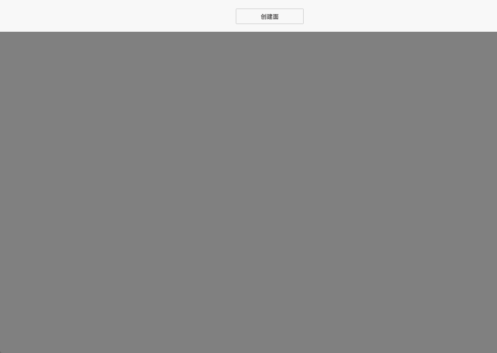

# createPlane

**描述：** 创建面

```typescript
const view = await System.UI.findControl('3D查看器1')// 获取画面中名为“3D查看器1”的3D查看器控件
const scene = await view.getScene();
scene.createPlane({
    name: 'Plane', //创建面的名字
    position:{ x: 10, y: 0, z: 0 }, //创建位置
    image: 'a.箭头.png', //创建面的贴图;(默认无)可以使用模型库中的贴图路径或者url;推荐图片格式: JPG、PNG、JPEG;
    doubleSide: true, //面是否双面显示(默认否)注意单面需要拖动鼠标查看
    color:'#6ec800',  //创建的面的颜色(默认灰白色)
    rotation:{x: 0, y: 0, z: 0},  //创建的面的旋转角度
    size:[20,11],  //创建面的初始长宽,默认12，12
    repeatX: 2, //图片在x方向的重复次数(默认1)
    repeatY: 2 ////图片在y方向的重复次数(默认1)
})
```
 


**示例：**

在按钮上编写上述代码，点击按钮，可以创建面 进入场景中




