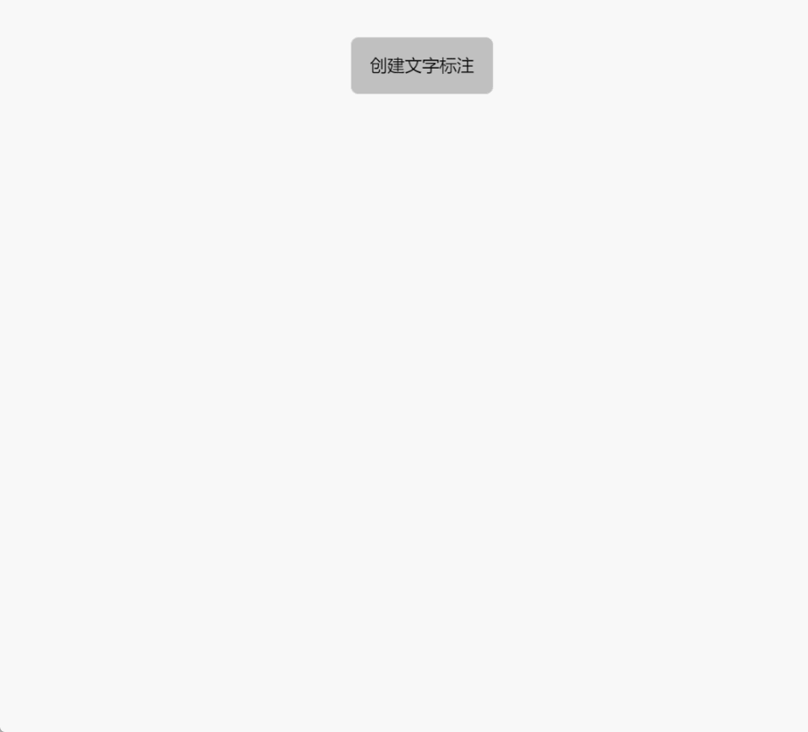

# createTextLabel

**描述：** 在指定位置创建文字标注(使用默认文字字体不支持修改)

```typescript
const view = await System.UI.findControl('3D查看器1')// 获取画面中名为“3D查看器1”的3D查看器控件
const scene = await view.getScene();
scene.createTextLabel({
    name: 'text1', //创建面文字标注的名字
    text: 'Hello World!', //文本标注的内容
    fontSize: 16, //字体大小(默认16)
    fontColor: '#6ec800', //字体颜色(默认灰白色)
    height:1,  //文字高度(默认1)
    position:{x: 0, y: 10, z: 0},  //创建文字的位置
    rotation:{x: 0, y: 10, z: 0},  //创建文字的旋转角度
    scale:{x: 1, y: 1, z: 1},     //创建文字的初始缩放
})
```
 


**示例：**

在按钮上编写上述代码，点击按钮，可以在指定位置创建文字标注




