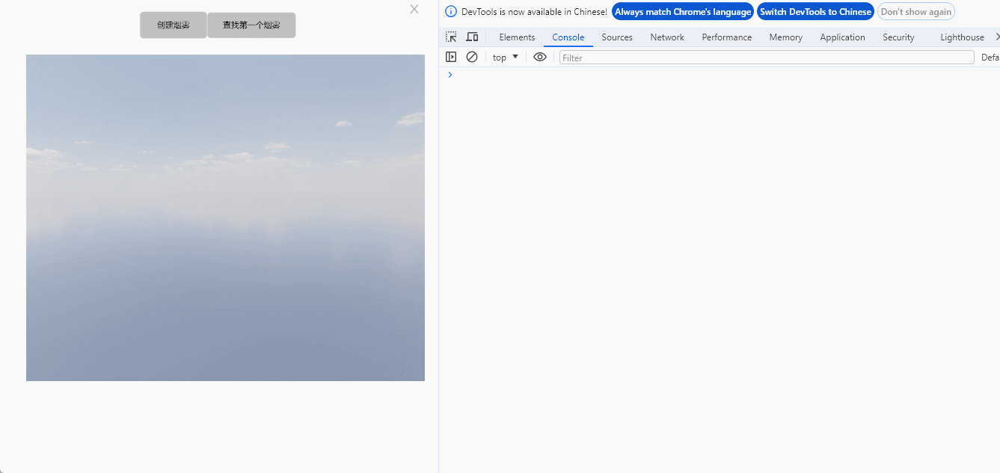

# findSmoke

**描述：** 查询场景中符合条件的第一个烟雾特效

查询烟雾：

```typescript
const view = await System.UI.findControl('3D查看器1')// 获取画面中名为“3D查看器1”的3D查看器控件
const scene = await view.getScene();
const mash = await scene.findSmoke('smoke') //查询名字包含smoke的第一个特效
console.log(mash) //输出所有查询到的结果
```
 
**示例：**

在按钮上编写上述代码，点击按钮，可以查询场景中名字包含 smoke 的第一个烟雾特效



查询到的模型可以使用其所有方法和属性：


