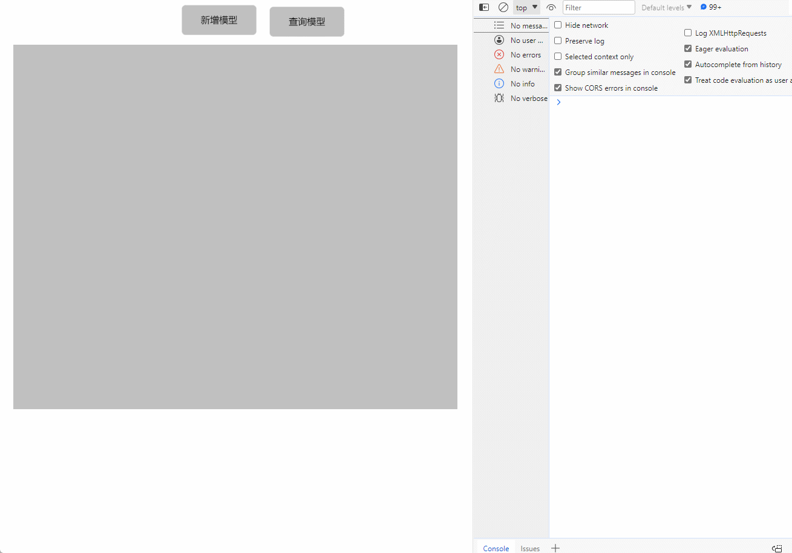

# query

**描述：** 查询场景中的物体

查询:

```typescript
const view = await System.UI.findControl('3D查看器1'); // 获取画面中名为“3D查看器1”的3D查看器控件
const scene = await view.getScene();
const mash = await scene.query({
    //id:"3b013f32-d6b0-484e-835c-e63e75d30ecb", //要查询物体的唯一uuid
    name: 'Box2', //要查询物体的名字
    type: 'Mesh', //要查询物体的类型
    userData: {   //要查询物体userData的内容   注: 根据userData中的键值对进行查询,需要键值对完全匹配
     test: "sth"
    }
})
```
 
**示例：**

在按钮上编写上述代码，点击按钮，可以查询创建的立方体的信息



