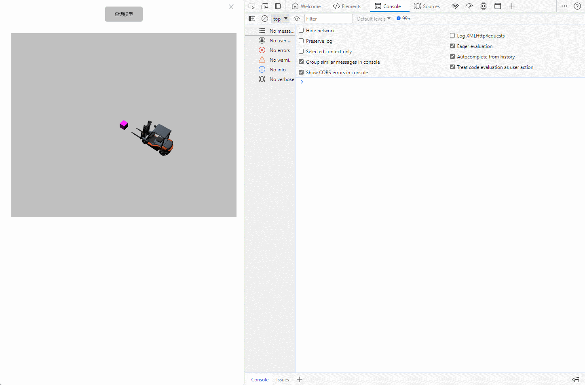

# queryMesh

**描述：** 查询场景中符合条件的全部模型

```typescript
const view = await System.UI.findControl('3D查看器1')// 获取画面中名为“3D查看器1”的3D查看器控件
const scene = await view.getScene();
const mash = await scene.queryMesh({
    //id:"3b013f32-d6b0-484e-835c-e63e75d30ecb", //要查询模型的唯一uuid
    name: 'chariot', //要查询模型的名字
    //userData  用户自定义的数据内容
})
console.log(mash)
```
 
**示例：**

在按钮上编写上述代码，点击按钮，可以查询场景中名为 chariot 的模型包括组



查询到的模型可以使用其所有方法和属性：


