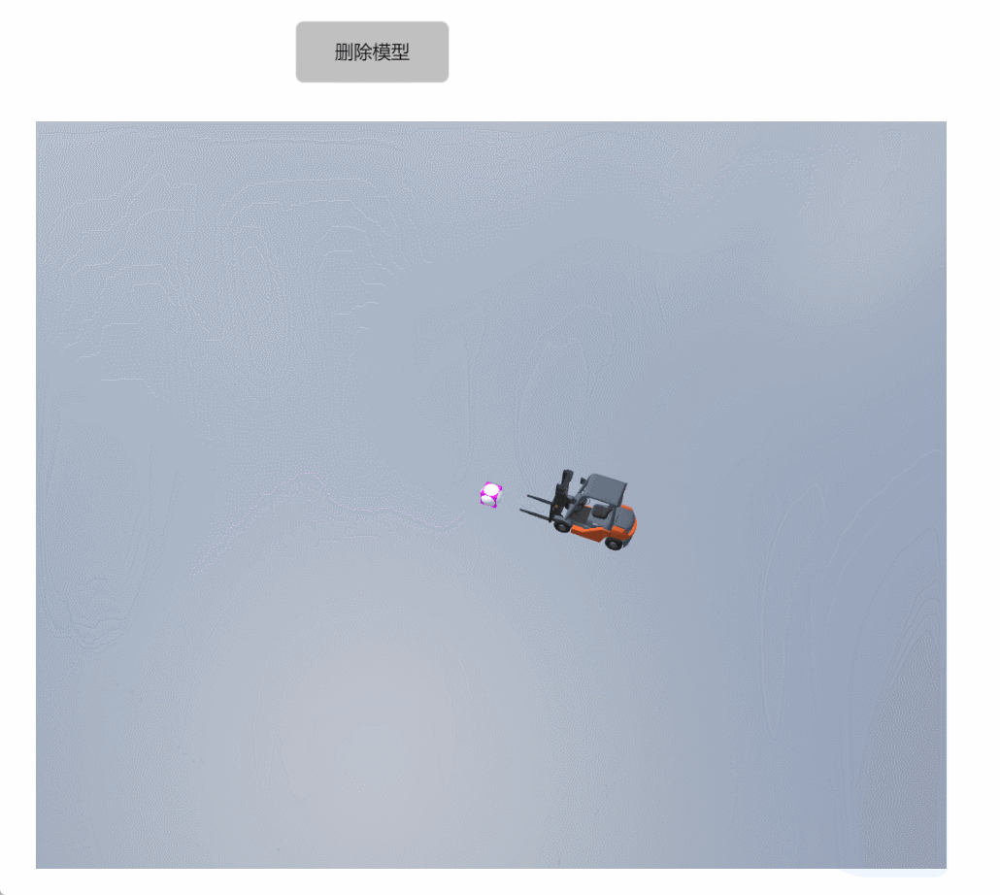

# remove
**描述：删除模型**

查询模型并删除:

```typescript
const view = await System.UI.findControl('3D查看器1')// 获取画面中名为“3D查看器1”的3D查看器控件
const scene = await view.getScene();
const chariot = await scene.query({
    name: 'chariot' , 
});//模糊查询名字包含chariot的模型，返回数组
chariot.forEach((ele)=>scene.remove(ele));//遍历数组做全部删除操作
```
 
**示例：**

在按钮上编写上述代码，点击按钮，将名字包含chariot的模型全部删除


3D场景模型：


