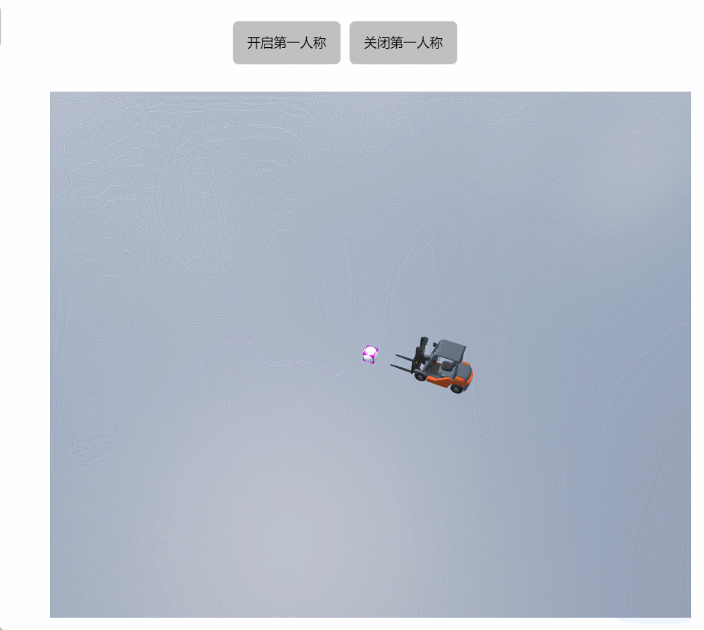

# stopFirstPersonControls

**描述：关闭第一人称模式**

```typescript
const view = await System.UI.findControl('3D查看器1')// 获取画面中名为“3D查看器1”的3D查看器控件
const scene = await view.getScene();
scene.stopFirstPersonControls();//关闭第一人称模式
```
 
**示例：**

在按钮上编写上述代码，点击按钮,关闭已经开启的第一人称模式。



