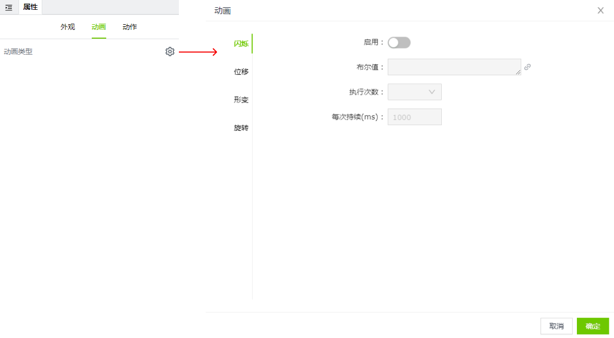
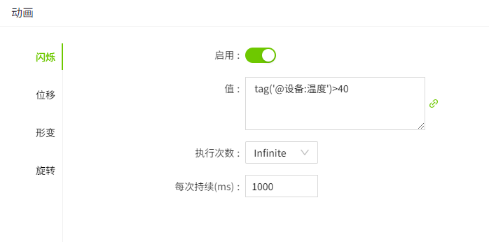
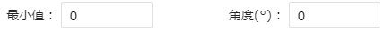
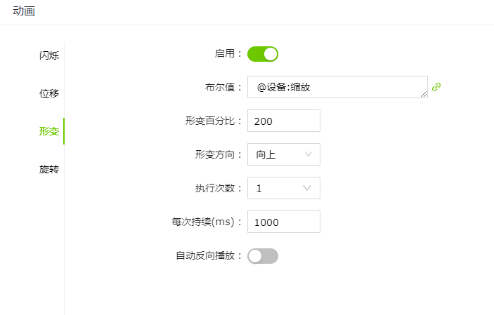

# **动画**

通过合理应用动画效果，可以为用户带来更高效、直观和愉悦的界面交互体验。

VC Hub中，当模型具有动画属性时，在右侧的属性栏中会显示“动画”一列，点击设置按钮可以进行动画设置。

## **动画类型**

VC Hub的3D模型支持以下动画类型：

#### 闪烁

闪烁效果易于引起注意，常用于出现非正常状态时的报警。

**示例**

创建一个球体模型，该模型表示报警指示灯，当“温度”的值大于40时该模型闪烁。

| 属性         | 值 |
|--------------|----|
| 闪烁启用状态 | 启用 |
| 每次持续(ms) | 每次闪烁执行的时间，单位 ms |
| 执行次数     | 当值为 true 时需要闪烁的次数 |
| 布尔值       | 表达式：tag('@设备:温度') > 40; `说明：该动画仅在值为布尔值时才生效。`|

#### 位移

通过路径让模型来进行位移动态效果。

**示例**

模型在传送带根据路径来位移。

| **属性**     | **值**            |
|:--------------|:--------|
| 位移启用状态 | 启用                                                                                            |
| 每次持续(ms) | 每次位移执行的时间，单位ms                                                                       |
| 执行次数     | 当值为true时候需要执行的次数                                                                    |
| 自动反向播放 | 模型位移到路径终点是否在反向位移回去                                                            |
| 面向         | 模型位移期间始终面向运动方向                                                                    |
| 路径         | 模型需要位移的路径                                                                              |
| 布尔值       | 变量：@设备：传送;    `说明：该动画仅在值为布尔值时才生效。`| 

#### **旋转**

模型随着值的变化而进行旋转。

| **属性**     | **值**   |
|:--------------|:------------|
| 旋转启用状态 | 启用          |
| 值           | 变量：设备:旋转Bool       |
| 类型         | 值的结果类型。分为数值型和布尔型。  数值型：      布尔型:    |
| 最小值       | 类型为数值型时，显示该参数。和“角度“属性组合起来使用。设置动画生效的最小值，以及最小值时模型的旋转角度。     |
| 最大值       | 类型为数值型时，显示该参数。和“角度“属性组合起来使用。设置动画生效的最大值，以及最大值时模型的旋转角度。     |
| X轴偏移(px)  | 用于设置旋转中心点向X轴偏移的距离。  |
| Y轴偏移(px)  | 用于设置旋转中心点向Y轴偏移的距离。  |
| Z轴偏移(px)  | 用于设置旋转中心点向Z轴偏移的距离。  |
| 方向         | 类型为布尔型时，显示该参数。表示旋转的方向。   |
| 旋转角度     | 类型为布尔型时，显示该参数。表示旋转多少度     |
| 执行次数     | 类型为布尔型时，显示该参数。表示需要执行的时候旋转多少次。 |
| 每次持续时间 | 类型为布尔型时，显示该参数。表示每次旋转持续时间。   |
| 自动反向播放 | 类型为布尔型时，显示该参数。表示旋转到指定角度后是否反向旋转回去。   |

#### 形变

通过值的变化，改变模型。

**示例**

正方体根据布尔值来判断要不要缩放。

| **属性**     | **值**                                                                                         |
|:--------------|:------------------------------------------------------------------------------------------------|
| 形变启用状态 | 启用                                                                                           |
| 布尔值       | 变量：@设备:缩放  `说明：该动画仅在值为布尔值时才生效。`
| 形变百分比   | 模型要形变的大小。                                                                              |
| 形变方向     | 模型要朝哪个方向形变。                                                                          |
| 执行次数     | 当值为true时候需要执行的次数。                                                                  |
| 每次持续     | 每次形变持续时间，单位ms。                                                                       |
| 自动反向播放 | 表示缩放到指定百分比后是否反向缩放回去。                                                        |
