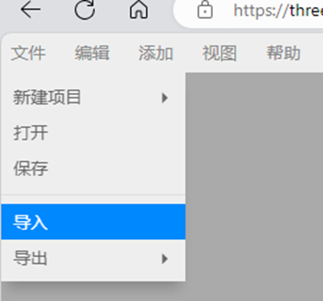

# **如何将3D模型转换为glb格式**

可以使用第三方工具，将非glb格式的3D模型文件，转换为glb格式。

## 工具1：blender

可以使用 **blender** 软件进行GLB格式转换。

**blender** 软件安装地址：***[blender.org- Home of the Blender project - Free and Open 3D Creation Software](https://www.blender.org/)***

**转换步骤：**

1. 导出 **blender** 软件可以打开的文件格式。
2. 最常见和最稳定的格式为 **FBX 、OBJ** ，建议使用这两种格式。
3. 文件导出后用 **blender** 软件打开，操作步骤如下。

    
4. 选择导入的模型，导出 **GLB** 格式文件。

    

## 工具2：three.js 在线编辑器

使用 **three.js** 编辑器转换格式。(推荐使用 **FBX** 和 **OBJ** 格式)

**three.js** 编辑器地址： ***[three.js editor (threejs.org)](https://threejs.org/editor/)***

**转换步骤：**

1.将3D文件导入 **three.js** 中。

  
2.选择 **GLB** 格式导出。

