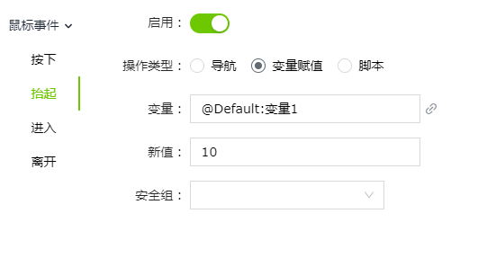

# 动作

VC Hub中，当模型具有动作属性时，在右侧的属性栏中会显示“动作”一列，点击设置按钮可以进行动作设置。

## **如何触发动作**

可以通过以下操作触发特定的动作。

#### **鼠标事件**

鼠标事件是指当用户使用鼠标对画面或者控件进行操作时，触发特定的动作。包含：

- 鼠标按下
- 鼠标抬起
- 鼠标进入
- 鼠标离开

## **动作类型**

#### **导航**

只需从画面列表中选择一个画面，当满足动作的触发条件时，即可打开该画面。当画面类型不同时，可以设置不同的画面打开位置。

**示例**

在场景编辑器中给场景添加一个立方体模型，当鼠标点击该模型按下后就打开一个弹窗来介绍模型的详细信息。

#### **变量赋值**

给变量赋新的值。

**示例**

当鼠标点击该模型抬起后就会修改变量1的值为10。

#### **脚本**

允许您编写自定义脚本实现更灵活的配置方式。

**示例**

当鼠标进入该模型范围后就会执行一段脚本。

#### **安全组**

若要设置所需的安全组，点击安全组的下拉按钮，在展开的列表中选择一个或多个角色。选择角色后，它们将被显示在选择框内。

一旦为某一动作设置了安全组，则在运行页面触发该动作时，会弹出登录窗口，要求用户进行身份验证。只有属于所设安全组的角色下的用户才有权限执行该动作。

> **Note:** 安全组功能仅在使用 Local 类型的 Identity Provider 进行身份验证时生效。