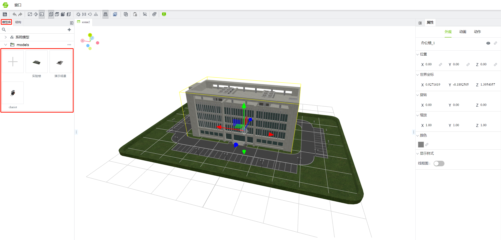

# 3D组态

VC Hub除了支持传统的2D组态外，还支持更为强大的3D组态。您可以像创建2D组态一样，创建3D组态项目，同时3D组态也提供了更为强大和灵活的低代码平台，使您能构建出真正的3D数字孪生应用。

VC Hub上支持的3D文件说明：

1. 仅支持.glb格式的文件。非glb格式的文件，请参阅[如何将3D模型转换为glb格式](convert-3d-models-to-glb-format/index.md)。
2. 单个模型文件大小 ≤20M（超出将无法启用浏览器缓存功能）。单个场景模型总大小需≤500MB，模型总数量≤3000个，三角面总数≤800万，灯光总数量≤50个。
3. 可以在3D绘制工具，例如3D Max，Auto CAD等工具内，将模型转换为glb格式。
4. 首次加载场景时长取决于网络带宽质量， 二次加载根据浏览器默认配置自动启用本地缓存（需满足单个模型≤20MB的前提条件 ）。

#### 3D模型要求

要想3D模型在编辑器内流畅运行，模型需满足以下要求：

1.  删除不可见区域的模型（如建筑物 内部结构、家具等）。
2.  将一个大的模型根据材质拆分为不同的模型，相同材质的模型附加为一个整体。
3.  模型材质推荐使用 3D Max 通用的物理材质球。
4.  单个材质不超过5张贴图，单个贴图大小不超过5M，每种物体根据需要自行调整反射值，如不需要反射值，将反射值调整为0,粗糙度调整为1即可。
5.  建模完成后，需要将模型转换为可编辑的多边形，并检查是否有断开的点或者面，确保模型能够完整连接。

#### 场景编辑器

在3D组态中，没有画面的概念，您首先要使用的就是[场景编辑器](introduction-to-scene-editor/index.md)。这里的场景，您可以简单理解为就是2D中的一个画面，所以场景编辑器的作用就类似于2D画面编辑器。您可以使用VC Hub提供的3D场景编辑器创建一个又一个3D画面（场景）。

#### 模型编辑器

在3D场景中，您可以使用一个一个独立的模型来构建您的整个3D场景，所以VC Hub为您提供了[模型编辑器](introduction-to-model-editor/index.md)，您可以将编辑好的模型导入导出到场景中使用。3D模型类似于您在2D组态中使用的各种控件，只是这些控件需要您从外部进行导入，然后进行相关组态配置再使用。

#### 3D低代码

通过场景编辑器和模型编辑器提供的组态功能，您就能像2D组态一样，组态出各种3D数字孪生监控应用。但如果您需要使用一些更高级的3D功能，比如动态创建3D模型到场景中，根据一些现场实时条件动态设置3D模型，那么 VC Hub 也向您开放了种类繁多的3D控制 API，您可以使用这些API构建出更丰富的3D场景。具体您可以参考[3D低代码示例](3d-low-code-example/index.md)。