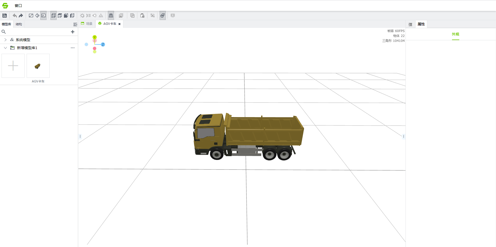
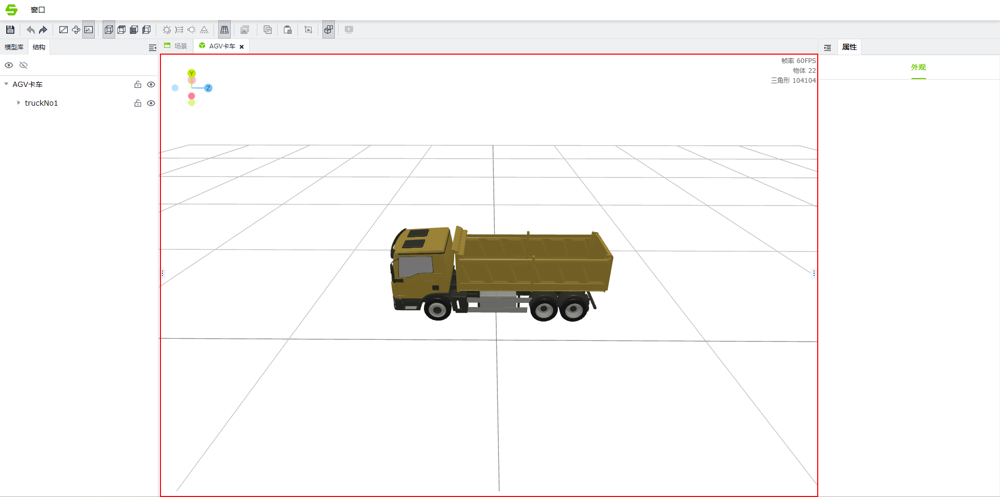
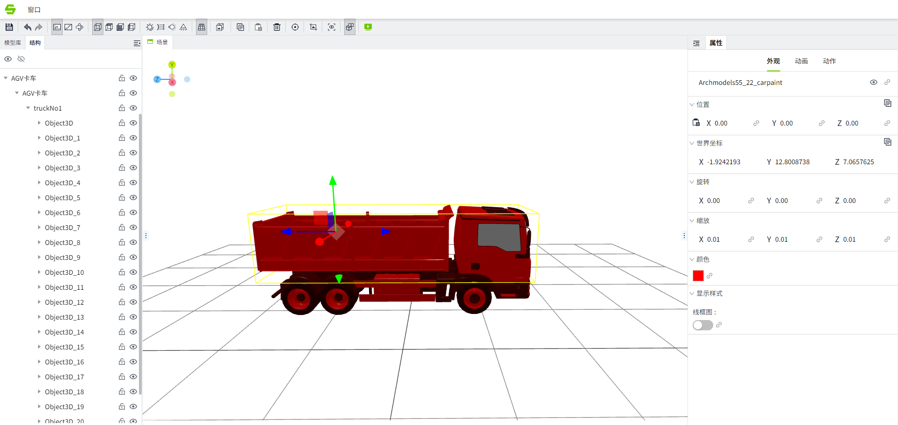

# **模型编辑器**

上传到模型库的模型可以在模型编辑器中进行修改。模型编辑器和场景编辑器操作是一样的，场景编辑器主要负责对场景进行操作，同时对多个模型修改，但对模型的修改只会在当前场景中生效，而模型编辑器修改的模型则会对场景引用的模型全部生效，值得注意的是，如果模型在编辑器中进行了修改，场景编辑器中对模型配置的修改将优先于模型编辑器中的配置。

模型编辑器可以通过场景编辑器右侧属性栏模型库来对模型右击进行操作，点击修改即可进入模型编辑器。

#### **编辑模型**

在下图红框区域显示模型。

可以对选中的模型节点进行位置、旋转、缩放和颜色及显示模式的编辑。编辑保存后，场景中已添加的模型将更新为新的配置。

