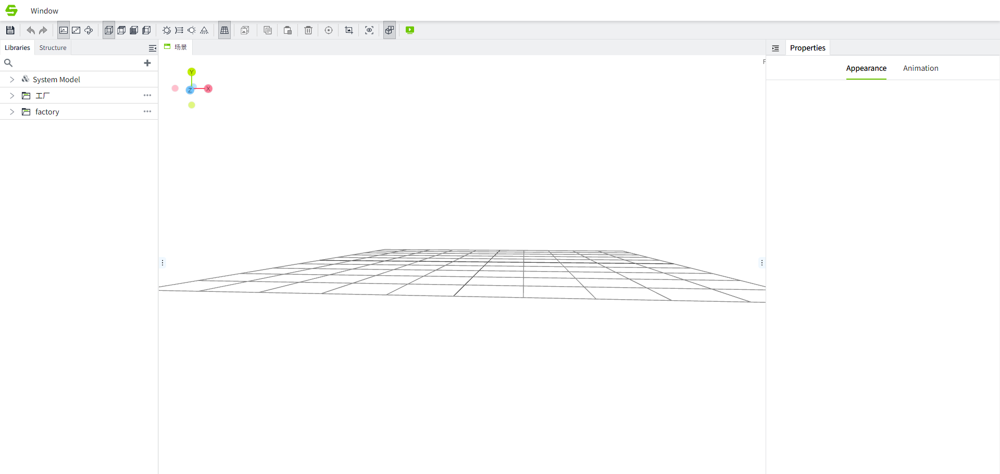
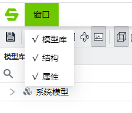
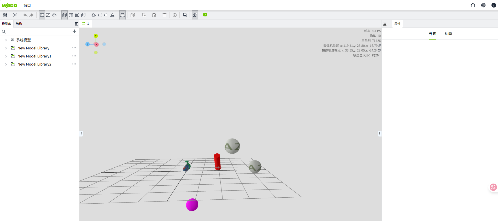

# 场景编辑器

您可以在场景编辑器内添加模型，设置模型属性，为模型设置动画、动作等。

## 添加场景

在" **3D Scenes** " 窗口中，点击右上角的➕按钮，添加场景。

在场景上点击鼠标右键，可以进行修改、重命名、导出、删除操作。

双击场景或者在右键弹窗中点击“修改“，进入场景编辑器。

## 工具栏

编辑器顶部有一个工具栏，当鼠标放在工具栏的任一按钮上时，会出现一个提示信息框标明此按钮的功能。

## 窗口菜单

编辑器带有许多窗口。您可以根据需要确认要打开的窗口，也可以根据使用习惯，调整窗口的显示位置和大小。

窗口显示形式示意：

形式一：

形式二：

| **窗口** | **描述** |
|:------------|:-----------------|
| 模型库  | 用于显示和管理模型素材。 |
| 结构  | 以树形结构显示当前所打开的场景中的模型，并显示模型的状态（锁定、隐藏、设置了动画、设置了动作），便于用户快速对模型进行操作。 |
| 属性 | 显示属性配置界面，便于对模型进行设置。|

## 场景编辑器

在该区域显示、操作模型。

## 预览场景

点击”预览“按钮进入预览模式，确保场景是按照预期结果展示的。

