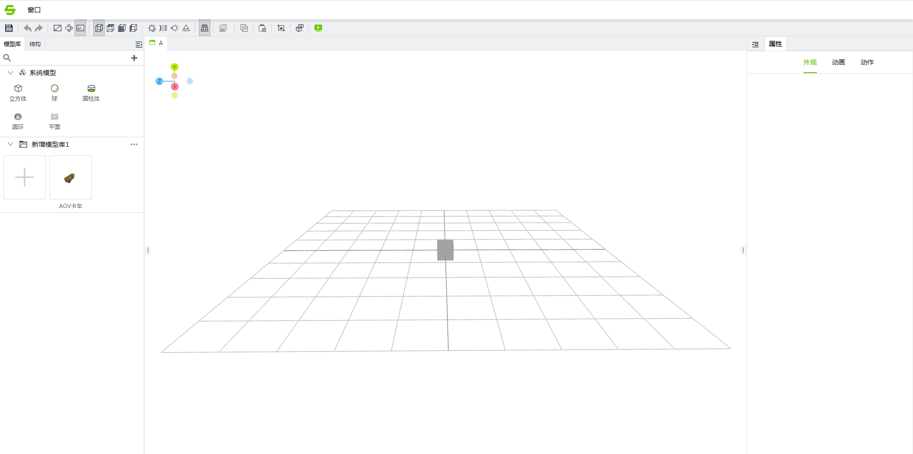
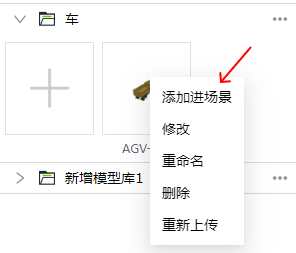
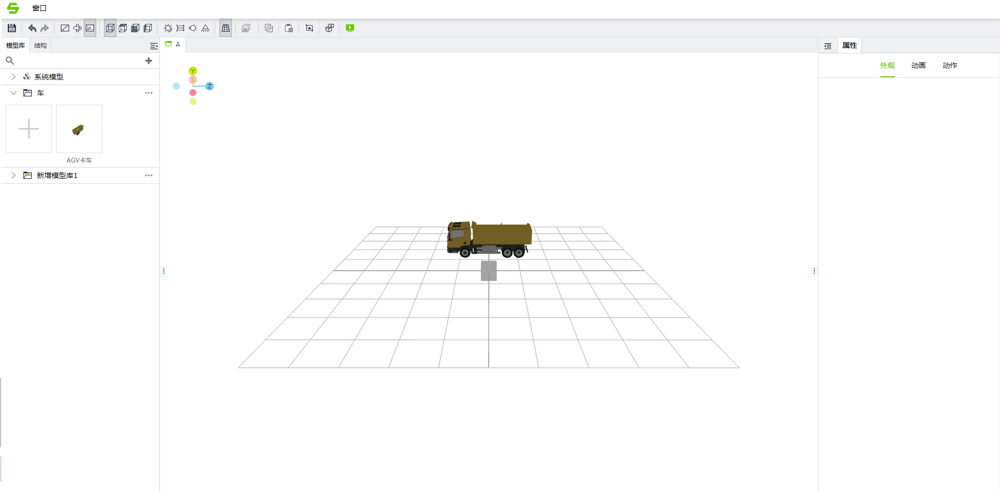
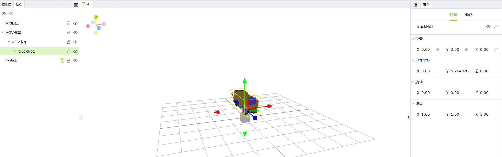
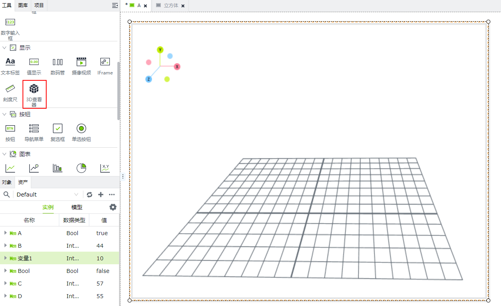

# **画面组态** 

当进入到场景编辑器中就能看到当前场景画面组态

在场景组态中有模型库、结构、属性

## **模型库**

模型库分为系统模型和本地模型库

#### **系统模型**

系统模型库始终在本地模型库上边，内置的有立方体、球、圆柱体、圆环、平面基础模型

双击系统模型可以给模型添加到场景中，系统模型不支持编辑修改操作，只能添加到场景中，添加到场景中默认位置x:0,y:0,z:0

#### **本地模型库**

您可以根据自己的喜好和实际需求添加模型。在图库窗口点击”新增“后，会自动创建一个本地模型库，且库名处于编辑状态。

您可以修改模型库名称(后续可双击模型库名称来再次修改名称)，修改完成后，单击模型库内的添加按钮。

将出现“打开”对话框窗口。只需在本地系统上找到您的需要上传的模型，可以多选，然后单击对话框的”打开”按钮即可上传所选模型。

## **使用模型**

1. 将模型上传到模型库中。
2. 从模型库中对模型右击添加到场景中或者双击模型

将模型添加到场景中会出现一个弹窗选择缩放比例

| 属性                 | 作用                                              |
|:----------------------|:---------------------------------------------------|
| 不缩放               | 模型会按照原本大小来添加入场景中                  |
| 缩放至网格大小       | 会将模型缩放至场景对应网格的大小                  |
| 缩放指定数量的单元格 | 网格中有许多单元格，会将模型缩放至单元格数量的大小 |

添加进场景中后就可以对进行外观、动画、动作操作 。

也可以对模型进行修改操作对模型修改操作会进入到模型编辑器中。

也可以对模型删除和重命名模型名称，模型如果在模型编辑器中正在编辑是不允许重命名、删除、重新上传的，只有关闭掉对应的模型编辑器才能重命名、删除、重新上传。

    
## **结构**

每个模型都有一个树形结构

选中模型后结构会有个锁定和隐藏图标，锁定模型后模型将禁止编辑，隐藏后模型会在任何时候不可见

##  **外观**

外观展示了当前选中模型基础信息，可以对基础信息进行编辑。

## **运行场景**

这里模型添加进场景中后就可以去2D画面添加”3D查看器”控件来运行场景了。

添加完3D查看器控件后要选择场景

此时再去运行画面就能看到自己的场景了

