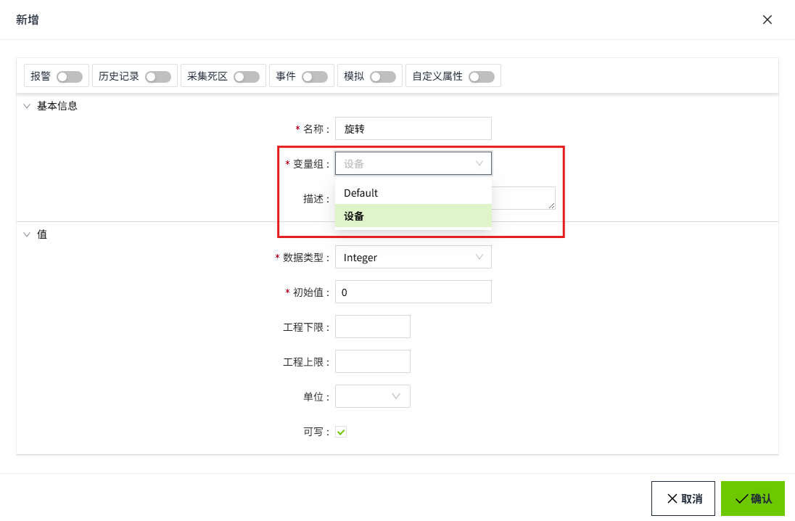

# System.Tag.subscribe


## 描述

订阅一个变量，变量发生变化时会获取变量的值、路径、质量位、时间。

## 语法

**System.Tag.subscribe(paths: Array`<string>`, callback: (value: {Time: string;Path: string;**

**Value: any;**

**Quality: number;}=>void): () => void**

- 参数

     paths - 变量路径数组

     callback - 回调函数，用于处理变量数值变化时的通知

- 返回

     取消订阅函数

## 代码示例

首先创建一个变量组，并将变量组的刷新类型选择为“数值变化”。


然后创建一个变量，并在变量组中勾选刚刚创建的变量组。



最后订阅变量“设备：旋转”后，变量发生变化时会接收到推送的数据并打印出新的值。

```typescript 
const unsubscript = System.Tag.subscribe(['@Device: Rotate'], (value) => {
    console.log('subscribe', value.Value);
});

// 60秒后取消订阅
setTimeout(() => {
    unsubscript();
}, 1000 * 60);
``` 
注意：如果变量组的刷新类型选择了周期性，订阅变量后将会按照该周期的频率获取变量值。
