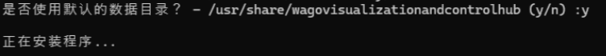
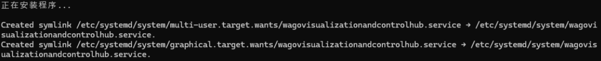
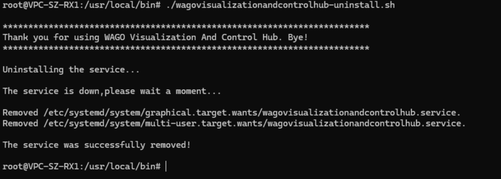

# Linux环境

WAGO VC Hub提供Linux环境安装包，文件名wagovc_hub-x.x.x-linux-x64-installer.run。

### 安装步骤

1. 拷贝安装包至Linux服务器某目录下。
2. 授予文件所有者执行安装文件的权限 。

     

3. 在目录下使用./+文件名的方式运行安装包。

    

4. 选择安装语言。

    

5. 自定义安装目录或使用默认安装目录。如果安装目录不存在，安装程序会主动创建。

    

    

6. 自定义数据目录或使用默认数据目录。

    

7. 等待安装，此过程需要一点时间，请耐心等待。

    

8. 安装完成。

    

9. 完成后默认访问WAGO VC Hub站点：“http://localhost:8066”，安装完成后，将进入配置引导界面。

#### **注意事项**:

1. 程序由Linux系统自带的systemd服务管理器监管和守护，请确保服务器的systemd运行正常。
2. 安装脚本包含创建脚本等操作，请确保有足够的权限。

#### **如何解决 libice6 / libsm6 安装失败的问题**

如果您在安装过程中看到提示：“**Failed to install libice6/libsm6. Please try installing it yourself.**”，可以按照以下步骤手动安装这些软件包：

1. 打开终端。
 
2. 更新软件包列表：

    ```
    sudo apt update
    ```

3. 安装所需的库：

    ```
    sudo apt install libice6 libsm6
    ```
    若安装成功，无需进行后续操作。<br>若遇到 “**Unmet dependencies**” 这类错误，或系统提示 “**try 'apt --fix-broken install'**”，则表示您的系统存在软件包依赖关系问题。。
    
    ```
    sudo apt --fix-broken install
    ```
    该命令将尝试通过安装缺失的依赖项或完成中断的安装过程，来修复不一致的软件包状态。

4. 修复成功后，请重试安装库文件：

    ```
    sudo apt install libice6 libsm6
    ```

#### 配置步骤

1. 阅读许可协议 

    

2. 创建管理员用户，请牢记此用户名和密码，接下来将使用此用户名和密码进行首次登录。

    

3. 端口配置，配置 HTTP, HTTPS 端口，请牢记访问端口。

    


4. 上述步骤完成后，等待程序加载完毕即可用步骤2中创建的管理员用户登录默认工程。

**说明**：如果升级安装会默认创建一个新的空的工程，要想回到原工程，需要登录新工程后，在工程列表中手动打开原工程。 

#### **安全配置（可选）**

为进一步提升系统安全性，建议在配置完成后执行以下步骤，对**服务目录**及**应用程序数据目录**进行权限设置，只有特定的用户才能对其进行操作，以确保敏感数据受到有效保护并避免潜在风险。

1. 创建专用服务账号  

    在系统中创建专用账号（如 wago_vc_hub），禁止交互式登录，仅用于运行服务进程：

    ```
    sudo useradd -r -s /sbin/nologin wago_vc_hub
    ```
 
    然后再通过 sudoers 文件设置免密码执行权限：

    ```
    wago_vc_hub ALL=(ALL) NOPASSWD: ALL
    ```
 
2. 设置服务安装目录权限

    将服务安装目录（如 /usr/local/bin/wagovisualizationandcontrolhub-x.x.x-linux-x64）的所有权交给 wago_vc_hub，确保其可执行，同时限制其他用户的访问：

    ```
    sudo chown -R wago_vc_hub:wago_vc_hub /usr/local/bin/wagovisualizationandcontrolhub-x.x.x-linux-x64
    sudo chmod -R 750 /usr/local/bin/wagovisualizationandcontrolhub-x.x.x-linux-x64
    ```
 
     **注意**：必须在修改服务运行账号之前完成此步骤，否则服务可能缺少访问权限。

3. 修改服务运行账号

    指定服务以 wago_vc_hub 身份运行：

    ```
    sudo systemctl edit visualizationandcontrolhub.service
    ```
 
    在 [Service] 部分添加：

    ```
    User=wago_vc_hub
    Group=wago_vc_hub
    ```
 
    保存后重新加载配置并重启服务：

    ```
    sudo systemctl daemon-reexec
    sudo systemctl restart visualizationandcontrolhub.service
    ```
 
4. 设置应用程序数据目录权限

    将数据目录（如/usr/share/wagovisualizationandcontrolhub-x.x.x-linux-x64）的所有权交给wago_vc_hub，确保其具有完整读写权限，同时限制其他用户的访问：

    ```
    sudo chown -R wago_vc_hub:wago_vc_hub /usr/share/wagovisualizationandcontrolhub
    sudo chmod -R 750 /usr/share/wagovisualizationandcontrolhub
    ```
 
5. 验证配置

    检查服务是否已成功以 wago_vc_hub 账号运行，并确认站点正常访问：

    ```
    systemctl status visualizationandcontrolhub.service
    ```
 
    在浏览器访问 WAGO VC Hub 站点（例如 http://localhost:8066），确认运行正常。

#### 卸载步骤

1. 进入到安装目录的上级目录。
2. 授予文件所有者执行卸载脚本“wagovc_hub-uninstall.sh”的权限 

    

3. 运行wagovc_hub-uninstall.sh脚本。

    

4. 以上操作后程序相关文件会被全部移除，并且进程守护服务也一并被移除。

**注意事项**：

卸载脚本包含删除文件等操作，请确保有足够的权限。

