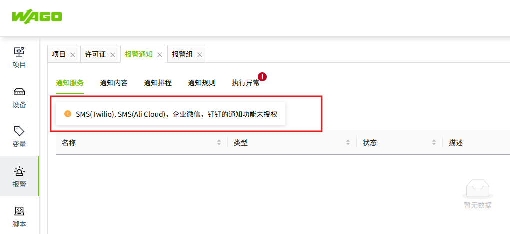

# 产品授权

### 试用版说明 

安装完成后，VC Hub 提供 30 天免费试用期。试用期内，您可以使用产品的所有功能。

您可以通过购买正式许可证来激活产品。目前仅支持在线激活。

### 产品授权说明

VC Hub 支持年度订阅和一次性购买两种方式。用户只能选择其中一种购买方式。

授权可基于以下几个功能模块进行：

#### I/O 变量

共有 6 种不同的许可证数量可供选择。您可以根据自身情况确定需要购买的许可证数量。

- 1,000 I/O 变量 
- 2,000 I/O 变量 
- 5,000 I/O 变量 
- 10,000 I/O 变量 
- 20,000 I/O 变量 
- 50,000 I/O 变量 

**注意事项**：

1.  标签数量不能累加。例如：如果您需要使用 3,000 个 I/O 标签，根据标签数量，您需要购买支持 ≥ 3000 个标签的许可证。因此，您需要购买支持 5,000 个 I/O 标签的许可证。
2.  如果 I/O 标签许可证未激活，该 I/O 标签的质量状态将显示为 "Bad_NotLicensed"
3.  如果创建的 I/O 标签数量超过 I/O 标签许可证允许的最大值，则根据标签排序规则，超出最大限制的标签其质量状态将被设置为 "Bad_NotLicensed"
4.  质量状态为“Bad_NotLicensed”（未授权）的标签将不再被收集或推送到预览和运行时页面。

#### 同时在线用户数

同时在线用户数包含三种不同类型的数据。
- 2 位同时在线用户
- 5 位同时在线用户
- 10 位同时在线用户

**注意事项**：

1.  如果用户未购买任何同时在线用户类型的许可证，则仅允许一个同时在线用户。
2.  同时在线用户也不支持累积。

#### 附加组件
以下功能模块为附加组件。

- 数据库：MySQL、SQL Server、PostgreSQL、InfluxDB
- 报表
- 告警通知：SMS（Twilio）、SMS（阿里云）、企业微信、钉钉
- Open API
- 驱动：MQTT Native、MQTT SparkplugB、WAGO Protocol
- 3D

**注意事项**：

1.  每个附加模块均可单独购买。
2.  对于未授权的模块，将在页面顶部显示一条消息，指出该模块没有许可证，例如：

    
    

3.  对于未授权的功能模块，在管理控制台和设计器页面允许进行正常操作（例如创建、删除、更新和查询），但在预览和运行时页面其功能将受到限制。