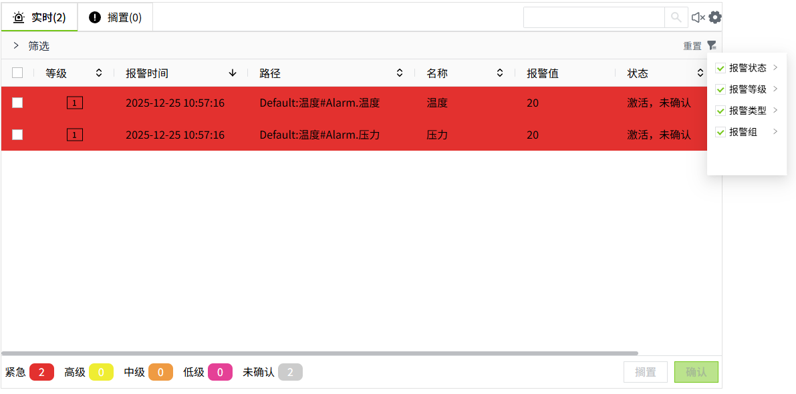
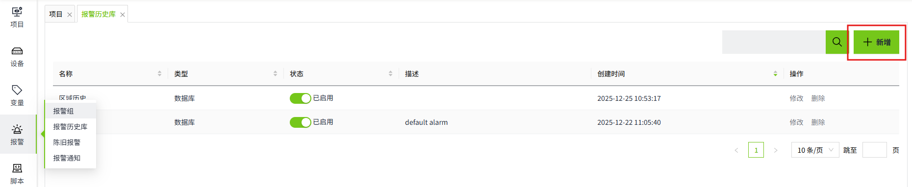

# 报警组

报警组用于将具有相似特性或相关性的报警进行归类。例如，将同一条生产线或同一设备的所有报警归为一个报警组，这样便于管理和监控。

在实时报警控件中，用户可以根据报警组来筛选或过滤报警信息。例如，可以在界面上只显示某个报警组的报警，这在大型系统中尤为重要，因为它减少了信息的冗余，提升了操作员的工作效率。

## 如何使用

#### 新增

1. 在“报警”->"报警组"页面，点击“新增”按钮创建报警组。

    

2. 在新增弹窗，设置报警组的名称，点击变量的“新增”按钮为该报警组添加变量。

    

    | **配置** | **描述**                          |
    |:----------|:-----------------------------------|
    | 名称     | 报警组的名称，名称不可重复，必填项。 |
    | 描述     | 报警组描述信息，可选填。            |
    | 变量     | 设置属于该报警组的变量。           |

3. 设置完成，点击“确认”按钮完成新增。

#### 查询

报警组默认以创建时间倒序排列，用户可以根据需要，自定义排序。

用户可以通过右上角输入框，按照报警组名称或变量路径进行模糊查询。当按变量路径查询时，查询结果显示该变量所属的所有报警组。

#### 修改

点击报警组列表任意数据的“修改“按钮，可以修改报警组的信息。在报警组的修改弹窗中会显示使用了该报警组的所有变量路径。

**注意**：修改报警组名称后，已使用了该报警组的变量，其报警组信息会丢失，请谨慎修改报警组名称。

#### 删除

点击报警组的删除按钮，对报警组进行删除。

**注意**：当报警组被删除后，绑定该报警组的变量，其报警组信息会丢失，请谨慎删除。

