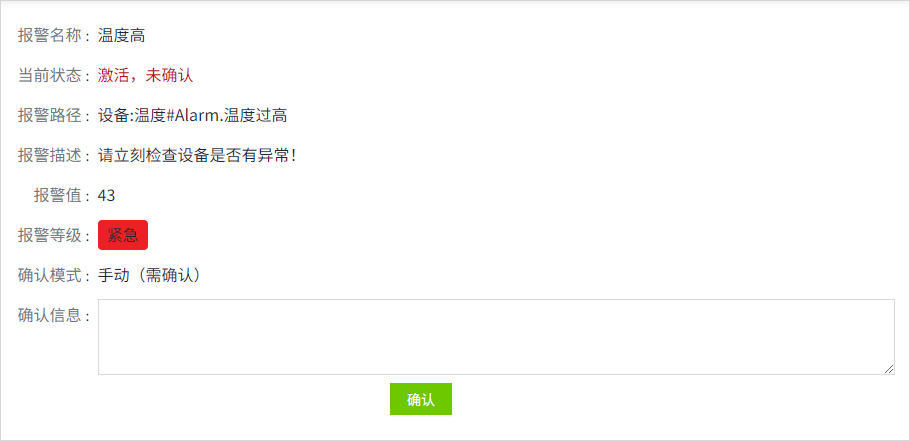
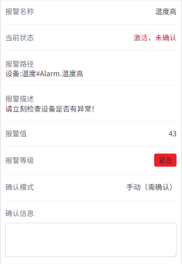

# 报警确认

当用户收到包含报警确认链接（该链接在通知内容中作为一个参数项进行配置）的邮件或短信时，可以通过点击链接来进行报警确认。用户点击邮件或短信中的链接后，在确认页面对报警进行确认。

## 通过邮件确认警报

1. 当您收到系统发出的报警通知邮件时，打开该邮件查看详情。

    

2. 点击邮件中报警确认地址的链接后，将会打开一个新窗口，显示与报警相关的详细数据。如果需要确认报警（如下图示例所示），请在页面上输入必要的确认信息，以便对该报警进行处理和记录。

    

3. 填写完成，点击**“确认**”按钮，完成报警确认。

## 通过短信确认警报

1. 当您收到系统发出的报警短信时，打开该短信查看详情。

    

2. 点击短信中的链接，会在浏览器中打开报警确认页面。如果需要确认报警，请在页面上（如下图所示）填写必要的确认信息。

    

3. 填写完成，点击“**确认**”按钮，完成报警确认。