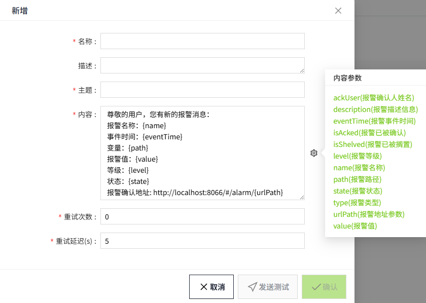
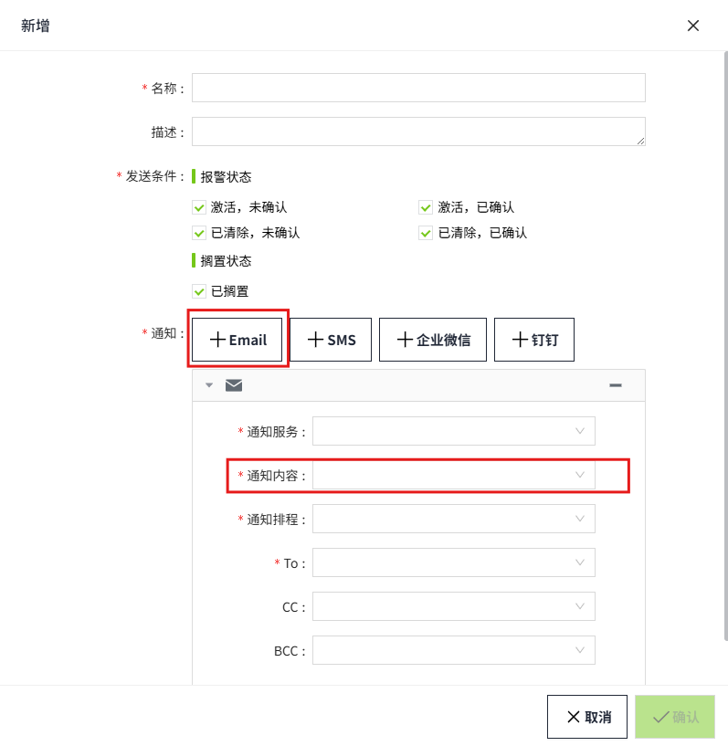

# Email(SMTP)

用于定义在报警触发时，邮件通知的内容。通过此设置，可以自定义邮件的标题、正文以及其他相关信息，以确保接收者能够快速理解和响应报警信息。

## 创建通知内容

1. 点击“**报警**”->"**报警通知**"->"**通知内容**"，进入通知内容列表页面。

    

2. 点击“**新增**”按钮。在新增弹窗中选择Email(SMTP)。

    

3. 点击下一步，进入详细配置界面。

    

4. 设置完成，点击“**发送测试**”，测试是否成功发送。
5. 测试成功后，点击“**确认**”按钮，添加该数据。

**属性**

| **名称** | **描述**|
|:----------|:-----------------------------------------------------------------------------------------------------------------------------------------------------------------------------------------------------------------------------------------------------------------------------------------------------------------------------------------------------------------------------------------------------------------------------------------------------------------------------------------------------------------------------------------------------------------------------------------------------------------------------------------------------------------------------------------------------------------------------------------------------------------------------------------------------------------------------------------------------------------------------------------------------------------------------------------------------------------------------------------------------------------------------------------------------------------------------------------------------------------------------------------------------------------------------------------------------------------------------------------------------------------------------------------------------------------------------------------------------------------------------------------------------------------|
| 名称     | 通知内容的名称，必填项，名称唯一、不可重复。|
| 描述     | 通知内容的描述信息，可选填。|
| 主题     | 邮件接收到的主题。 |
| 内容     | 邮件接收到的内容。  点击内容的设置按钮，弹出内容参数弹窗。此处设置的参数，在报警发生时，将使用真实值进行替换。在内容窗口中点击鼠标，之后再点击参数的设置按钮，在参数列表中单击所需参数，该参数将自动插入到光标所在的位置。 **消息参数**    **说明**： urlPath（报警地址参数）用于构造报警信息的URL，它由服务器地址、端口号和具体的页面路径组成。具体解释如下：   1. **服务器地址和端口号**： `http://localhost:4300` 这表示请求将被发送到一个名为"**localhost**"的服务器，并通过端口号"**4300**"进行访问，在新增的时候会自动获取当前服务器地址和端口。  2. **页面路径**： `/#/alarm/` 此路径是固定的，指向报警确认页面。  3. **具体路径**： `{urlPath}` 这是一个占位符，表示具体的报警参数路径。在实际接收报警通知时，会将此占位符替换为实际的报警参数。 |
| 重试次数 | 邮件发送失败后的重试次数。 |
| 重试延迟 | 邮件发送失败后，重试发送的延迟时间。|
| 发送测试 | 完成上述配置后，点击‘发送测试’按钮，将弹出一个新窗口。在新窗口中输入用于接收测试邮件的邮箱地址，并选择已创建的邮件服务，点击‘发送’按钮即可检查邮件是否能正确接收。  |

## 通知内容应用

在报警的通知规则中将选择通知内容。

1. 点击“**报警**”->"**报警通知**"->"**通知规则**"，进入通知规则列表页面。
2. 点击列表右上角的“**新增**”按钮。
3. 在新增弹窗中点击通知的'**+Email**'按钮，新增一个Email通知规则，在通知内容下拉列表中选择创建好的通知内容。

    

