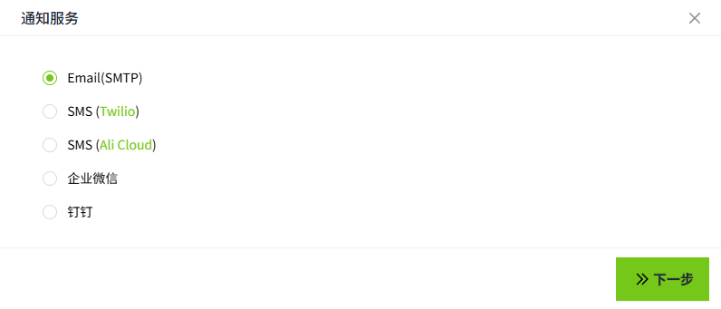

# Messages

You can set different notification content for different notification services.

Supports the following five types of content settings:

- [Email(SMTP)](email.md) 
- [SMS(Twilio)](sms-twilio.md) 
- [SMS(Ali Cloud)](sms-alicloud.md) 
- [WeCom](wecom.md)
- [DingTalk](dingtalk.md) 

When an alarm is triggered, users will receive the alarm notification.