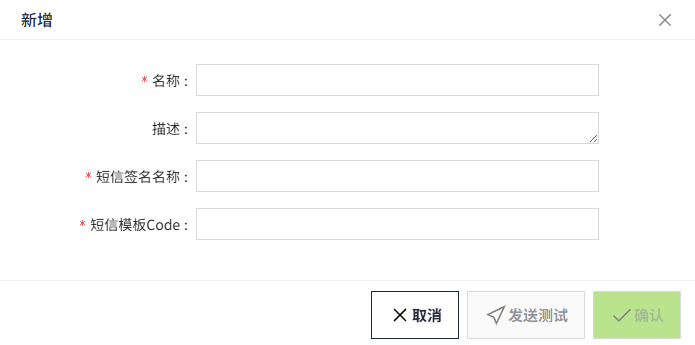

# SMS(Ali Cloud)

该配置用于定义在报警触发时，通过Ali Cloud发送的短信通知所包含的内容。

## 创建通知内容

1. 点击“**报警**”->"**报警通知**"->"**通知内容**"，进入通知内容列表页面。

    

2. 点击“**新增**”按钮。在新增弹窗中选择Email(Ali Cloud)。

    

3. 点击下一步，进入详细配置界面。

    

4. 设置完成，点击“**发送测**”，测试是否成功发送。
5. 测试成功后，点击“**确认**”按钮，添加该数据。

**属性**

| **名称**     | **描述**|
|:--------------|:----------------------------------------------------------------------------------------------------------------------------------------------------------------------------------------------------------------------------------------------------------------------------------------------------------------------------------------------------------------------------------------------|
| 名称         | 通知内容的名称，必填项，名称唯一、不可重复。|
| 描述         | 通知内容的描述信息，可选填。|
| 短信签名名称 | 在阿里云短信服务中成功申请的签名名称。  |
| 短信模板Code | 在阿里云短信模板管理中成功申请的模板Code。  |
| 发送测试     | 完成上述配置后，点击‘发送测试’按钮，将弹出一个新窗口。在新窗口中输入用于接收测试短信的手机号码，并选择已创建的SMS(Ali Cloud)类型的通知服务，点击‘发送’按钮即可检查短信是否能正确接收。   |

#### 通知内容应用

在报警的**通知规则**中将选择通知内容。

1. 点击“**报警**”->"**报警通知**"->"**通知规则**"，进入通知规则列表页面。
2. 点击列表右上角的“新增“按钮。
3. 在新增弹窗中点击通知的'**+SMS**'按钮，新增一个短信通知规则，在通知内容下拉列表中选择创建好的通知内容。

    [alt text](17.png)

**说明**：通知内容和通知服务必须匹配。例如，选择 SMS(Ali Cloud)类型的通知服务时，通知类型也应选择 SMS(Ali Cloud)。 

