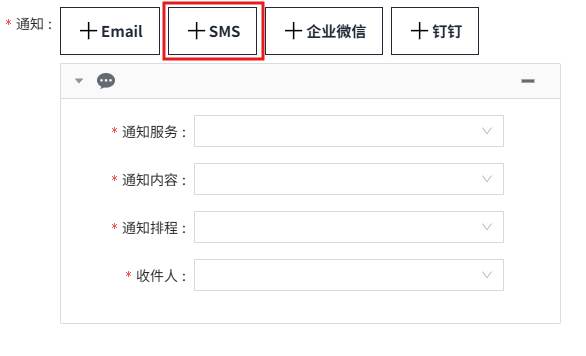
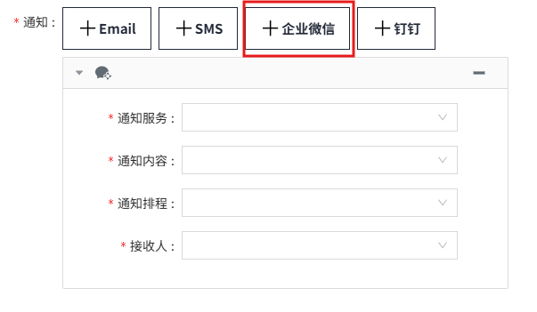
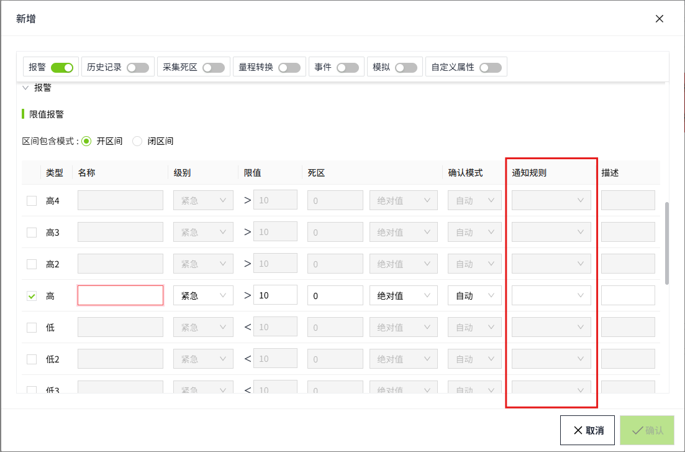

# 通知规则

通知规则提供了灵活的配置选项，使您能够详细设置报警的发送条件、通知的服务类型（如邮件、短信）、接收人列表以及通知的发送时间，从而确保重要信息能够及时传达给相关人员。

## 新增

1. 在“**报警**”->"**报警通知**"->"**通知规则**"页面，进入通知规则列表页面。

    

2. 点击“**新增**”按钮。在新增弹窗中进行属性设置。

    

3. 设置输入后，单击‘**确认**’按钮。

**属性**

| **名称** | **描述** |
|:----------|:---------------------------------------------------------------------------------------------------------------------------------------------------------------------------------------------------------------------------------------------------------------------------------------------------------------------------------------------------------------------------------------------------------------------------------------------------------------------------------------------------------------------------------------------------------------------------------------------------------------------------------------------------------------------------------------------------------------------------------------------------------------------------------------------------------------------------------------------------------------------------------------------------------------------------------------------------------------------------------------------------------------------------------------------------------------------------------------------------------------------------------------------------------------------------------------------------------------------------------------------------------------------------------------------------------------------------------------------------------------------------------------------------------------------------------------------------------------------------------------------------------------------------------------------------------------------------------------------------------------------------------------------------------------------------------------------------------------------------------------------------------------------------------------------------------------------------------------------------------------------------------------------------------------------------------------------------------------------------------------------------------------------------------------------------------------------------------------------------------------------------------------------------------------------------------------------------------------------------------------------------------------------------------------------------------------------------------------------------------------------------------------------------------------------------------------------------------------------------------------------------------------------------------------------------------------------------------------------------------------------------------------------------------------------------------------------------------------------------------------------------------------------------------------------------------------------------------------------------------------------------------------------------------------------------------------------------------------------------------------------------------------------------------------------------------------------------------------------------------------------------------------------------------------------------------------------------------------------------------------------------------------------------------------------------------------------------------------------------------------------------------------------------------------------------------------------------------------------------------------------------------------------------------------------------------------------------------------------------------------------------------------------------------------------------------------------------------------------------------------------------------------------------------------------------------------------------------------------------------------------------------------------------------------------------------------------------------------------------------------------------------------------------------------------------------------------------------------------------------------------------------------------------------------------------------------------------------------------------------------------------------------------------------------------------------------------------------------------------------------------------------------------------------------------------------------------------------------------------------------------------------------------------------------------------------------------------------------------------------------------------------------------------|
| 名称     | 通知规则的名称，必填项，名称唯一、不可重复。|
| 描述     | 通知规则的描述信息，可选填。|
| 发送条件 | 根据报警状态或搁置状态来决定是否发送报警通知。|
| 通知     | 包含4种通知类型，Email，SMS，企业微信，钉钉。点击对应按钮显示对应设置界面。  |

**"通知"的详细介绍**

| **名称** | **描述** |
|:----------|:---------------------------------------------------------------------------------------------------------------------------------------------------------------------------------------------------------------------------------------------------------------------------------------------------------------------------------------------------------------------------------------------------------------------------------------------------------------------------------------------------------------------------------------------------------------------------------------------------------------------------------------------------------------------------------------------------------------------------------------------------------------------------------------------------------------------------------------------------------------------------------------------------------------------------------------------------------------------------------------------------------------------------------------------------------------------------------------------------------------------------------------------------------------------------------------------------------------------------------------------------------------------------------------------------------------------------------------------------------------------------------------------------------------------------------------------------------------------------------------------------------------------------------------------------------------------------------------------------------------------------------------------------------------------------------------------------------------------------------------------------------------------------------------------------------------------------------------------------------------------------------------------------------------------------------------------------------------------------------------------------------------------------------------------------------------------------------------------------------------------------------------------------------------------------------------------------------------------------------------------------------------------------------------------------------------------------------------------------------------------------------------------------------------------------------------------------------------------------------------------------------------------------------------------------------------------------------------------------------------------------------------------------------------------------------------------------------------------------------------------------------------------------------------------------------------------------------------------------------------------------------------------------------------------------------------------------------------------------------------------------------------------------------------------------------------------------------------------------------------------------------------------------------------------------------------------------------------------------------------------------------------------------------------------------------------------------------------------------------------------------------------------------------------------------------------------------------------------------------------------------------------------------------------------------------------------------------------------------------------------------------------------------------------------------------------------------------------------------------------------------------------------------------------------------------------------------------------------------------------------------------------------------------------------------------------------------------------------------------------------------------------------------------------------------------------------------------------------------------------------------------------------------------------------------------------------------------------------------------------------------------------------------------------------------------------------------------------------------------------------------------------------------------------------------------------------------------------------------------------------------------------------------------------------------------------------------------------------------------------------------------------------------|
|Email    |    - 通知服务：下拉选择已创建并且处于启用状态的Email(SMTP)类型的通知服务。  - 通知内容：根据通知服务自动过滤，仅显示已创建并且处于启用状态的Email(SMTP)类型的通知内容。  - 通知排程：下拉选择已创建并且处于启用状态的常规类型的排程。  - To: 设置邮件的接收人。下拉选择用户组，可以多选。选择用户组后，点击后方的...按钮，显示所选用户组下的所有用户。  - CC: 设置邮件的抄送人。下拉选择用户组，可以多选。选择用户组后，点击后方的...按钮，显示所选用户组下的所有用户。  - BCC：设置密送人员。下拉选择用户组，可以多选。选择用户组后，点击后方的...按钮，显示所选用户组下的所有用户。   **说明**：当使用OpenID Connect方式登录时，如果希望用户能收到报警通知，需手动在WAGO VC Hub中创建用户，并将用户添加到相应的用户组中。 | 
 | SMS      |    - 通知服务：下拉选择已创建并且处于启用状态的SMS(Ali Cloud)和SMS(Twilio)类型的通知服务。  - 通知内容：根据通知服务自动过滤，例如选择了SMS(Ali Cloud)类型的通知服务，则在通知内容下拉列表中只会显示SMS(Ali Cloud)类型的通知内容。  - 通知排程：下拉选择已创建并且处于启用状态的常规类型的排程。  - 收件人: 设置接收报警通知短信的人员。下拉选择用户组，可以多选。选择用户组后，点击后方的...按钮，显示所选用户组下的所有用户。   **说明**：当使用OpenID Connect方式登录时，如果希望用户能收到报警通知，需手动在WAGO VC Hub中创建用户，并将用户添加到相应的用户组中。 | 
 | 企业微信 |    - 通知服务：下拉选择已创建并且处于启用状态的企业微信类型的通知服务。  - 通知内容：根据通知服务自动过滤，例如选择了企业微信类型的通知服务，则在通知内容下拉列表中只会显示企业微信类型的通知内容。  - 通知排程：下拉选择已创建并且处于启用状态的常规类型的排程。  - 接收人: 设置接收报警通知的人员。根绝选择的通知服务自动显示对应内容。下拉选择接收人，可多选，可以选择微信群组，也可以选择微信账号。| 
 | 钉钉     |    - 通知服务：下拉选择已创建并且处于启用状态的钉钉类型的通知服务。  - 通知内容：根据通知服务自动过滤，例如选择了钉钉类型的通知服务，则在通知内容下拉列表中只会显示钉钉类型的通知内容。  - 通知排程：下拉选择已创建并且处于启用状态的常规类型的排程。  - 接收人: 设置接收报警通知的人员。根绝选择的通知服务自动显示对应内容。下拉选择接收人，可多选，可以选择钉钉群，也可以选择钉钉账号。 | 

## 通知规则应用

在变量的每条报警上设置通知规则。当该报警触发时，系统会根据设置的通知规则自动向相关人员发送报警通知。

