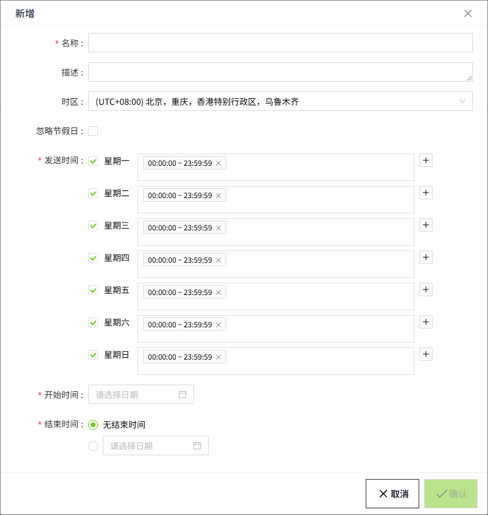
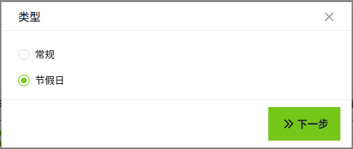
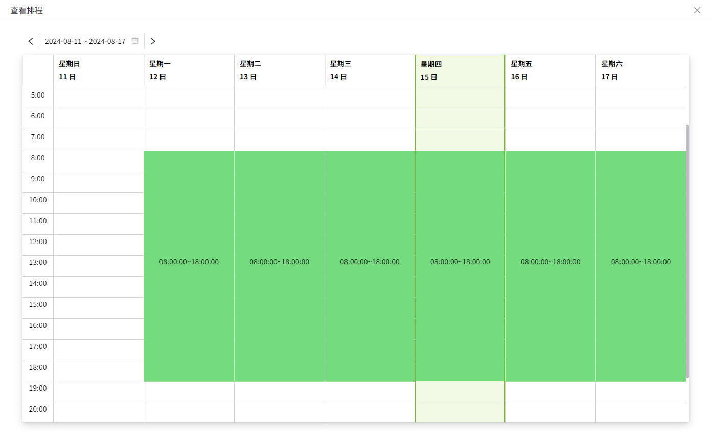
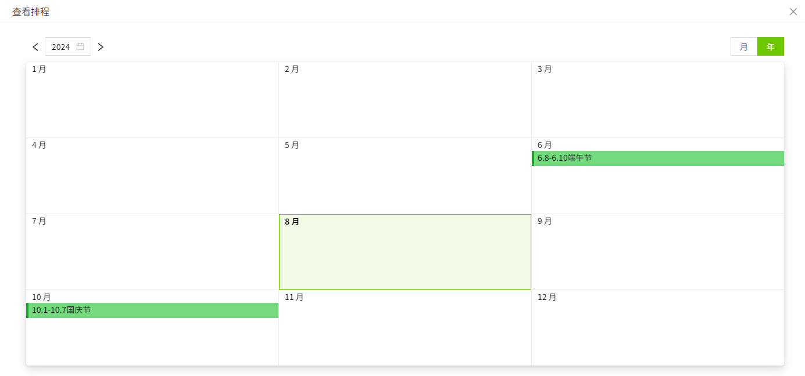

# 通知排程

通知排程用于管理和设置在特定时间或日期发送报警通知的计划。通过配置通知排程，用户可以灵活地控制WAGO VC Hub系统在不同时间点或日期发送通知。这对于确保在适当的时间向用户发送报警信息非常重要，避免不必要的干扰或错过关键的通知。例如您可以设置周一至周五，每天的09:00~18:00之间发送报警通知。

## 常规排程

1. 在“**报警**”->“**报警通知**”->“**通知排程**”页面，进入通知排程列表页面。。

    

2. 点击“**新增**”按钮。在新增弹窗中选择常规。

    

3. 点击“”下一步”，进入详细配置界面。

    

    **属性**

    | 名称       | **描述** |
    |:------------|:-------------------------------------------------------------------------------------------------------------------------------------------------------------|
    | 名称       | 排程名称，必填且不可重复。|
    | 描述       | 排程的描述信息，选填。|
    | 时区       | 排程运行所依据的时区。|
    | 忽略节假日 | 是否在节假日期间暂停通知发送。如果勾选，则节假日正常发送报警通知。|
    | 发送时间   | 用户可以设置在平时（如工作日）的特定时间段内发送通知。可选多个时间段，并细化到具体的时分秒。|
    | 开始时间   | 设置排程生效的起始时间。|
    | 结束时间   | | 无结束时间 | 排程将持续执行，直到手动停用或修改。 | |------------|------------------------------------| | 结束时间   | 设置排程失效的结束时间。            | |

4. 设置完成，点击“确认”按钮完成新增。

## 节假日排程

1. 在“**报警**”->“**报警通知**”->“**通知排程**”页面，进入通知排程列表页面。

    

2. 点击“**新增**”按钮。在新增弹窗中选择“**节假日**”。

    

3. 点击下一步，进入详细配置界面。

    

    **属性**

    | **名称** | **描述** |
    |:----------|:-------------------------------------------------------------------------------------------|
    | 名称     | 排程的名称，名称不可重复，必填项。|
    | 描述     | 排程描述信息，可选填。|
    | 时区     | 排程按照那个时区运行 |
    | 日期     |  - 开始日期：节假日开始时间  - 结束日期:节假日结束时间 |

4. 设置完成，点击“**确认**”按钮完成新增。

## 查看排程

点击“常规排程”中的“**查看排程**”，即可在弹出的排程表中查看当前的排程日期。

点击“节假日排程”中的“查看排程”，弹出的排程表将显示所有节假日的日期。

通知排程的核心目的是确保通知的发送符合预期的时间和日期要求，避免在不合适的时间发送不必要的通知，同时确保关键时刻的通知能够及时送达。

## 应用

在报警的通知规则中将选择通知内容。

1. 点击“**报警**”->“**报警通知**”->“**通知规则**”，进入通知规则列表页面。
2. 点击列表右上角的“**新增**”按钮。
3. 在新增弹窗中点击通知的'**+Email**'或'**+SMS**'按钮，新增一个通知规则，可以在通知排程中选择刚刚创建的通知排程。

    

**说明**：通知排程只能选择常规排程。节假日排程的目的是决定常规排程在发送时是否忽略这些节假日。

