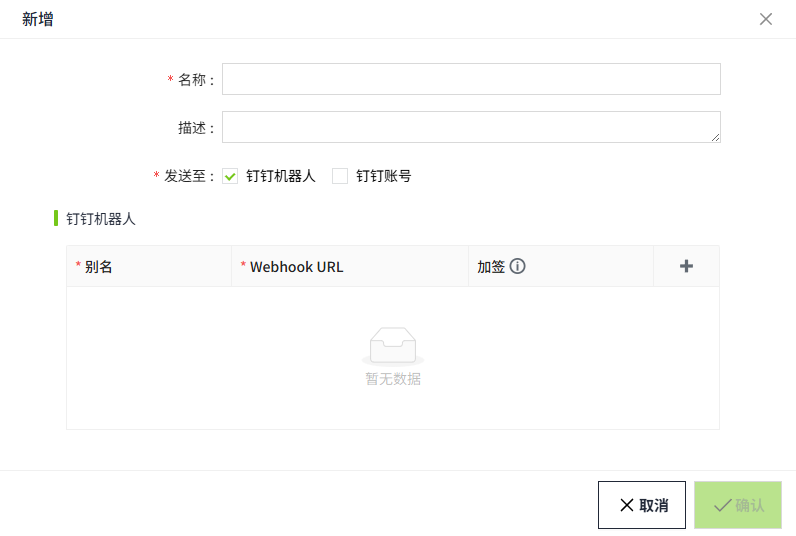
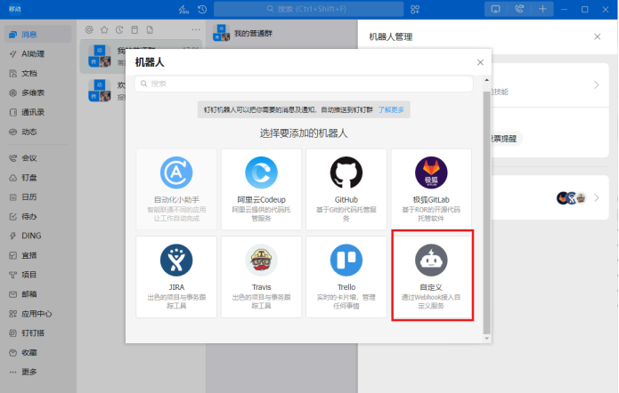
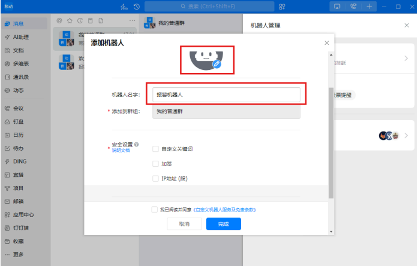
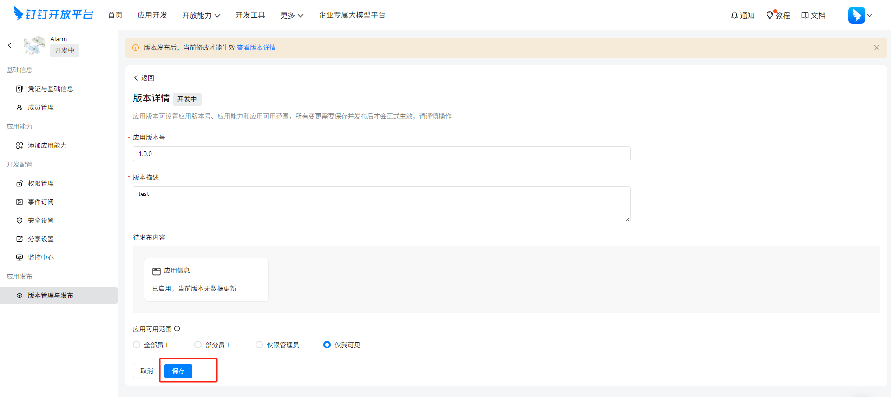
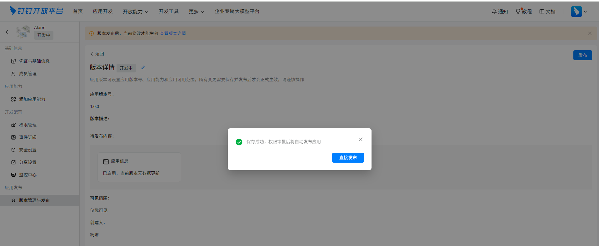
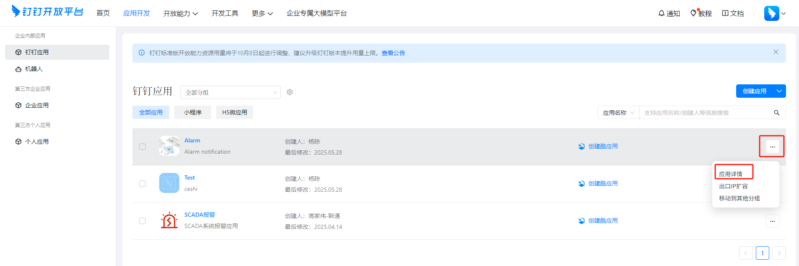

# 钉钉

用来配置通过钉钉给特定的群组或者账号发送报警通知。

## 创建钉钉服务

1. 点击“**报警**”->"**报警通知**"->"**通知服务**"，进入通知服务列表页面。

    

2. 点击右上角“**新增**”按钮。在新增弹窗中选择钉钉。

    

3. 点击下一步，进入详细配置界面。

    

    “发送至”默认选择钉钉机器人，如果想发给个人，请勾选钉钉账号，两者允许同时选择。

    

4. 设置完成后，点击'**确认**'按钮，添加该条配置数据。

**属性**

| **名称**   | **描述** |
|:------------|:------------------------------------------------------------------------------------------------------------------------------------------------------------------------------------------------------------------------------------------------------------------------------------------------------------------------------------------------------------------------------------------------------------------------------------------------------------------------------------------------------------------------------------------------------------------------------------------------------------------------------------------------------------------------------------------------------------------------------------------------------------------------------------------------------------------------------------------------------------------------------------------------------------------------------------------------------------------------------------------------------------------------------------------------------------------------------------------------------------------------------------------------------------------------------------------------------------------------------------------------------------------------------------------------------------------------------------------------------------------------------------------------------------------------------------------------------------------------------------------------------------------------------------------------------------------------------------------------------------------------------------------------------------------------------------------------------------------------------------------------------------------------------------------------------------------------------------------------------------------------------------------------------------------------------------------------------------------------------------------------------------------------------------------------------------------------------------------------------------------------------------------------------------------------------------------------------------------------------------------------------------------------------------------------------------------------------------------------------------------------------------------------------------------------------------------------------------------------------------------------------------------------------------------------------------------------------------------------------------------------------------------------------------------------------------------------------------------------------------------------------------------------------------------------------------------------------------------------------------------------------------------------------------------------------------------------------------------------------------------------------------------------------------------------------------------------------------------------------------------------------------------------------------------------------------------------------------------------------------------------------------------------------------------------------------------------------------------------------------------------------------------------------------------------------------------------------------------------------------------------------------------------------------------------------------------------------------------------------------------------------------------------------------------------------------------------------------------------------|
| 名称       | 通知服务名称。|
| 描述       | 通知服务描述。|
| 发送至     | 设置要发送给哪些人，可以是钉钉机器人，也可以是钉钉账号。选择后，需在页面下方添加对应的信息。|
| 钉钉机器人 | 当“发送至”选择了钉钉机器人时，显示该配置项。该机器人在哪个群，后续就会对该群的用户发送报警通知。   - **别名**：群机器人的名称。  - **群机器人Webhook地址**：在群聊中配置机器人后，系统自动生成的一条 HTTP 接口地址。    Webhook 地址的形式通常是：https://oapi.dingtalk.com/robot/send?access_token*=......*   - `oapi.dingtalk.com`：钉钉开放平台 API 域名  - `/robot/send`：群机器人消息推送固定路径  - `access_token=…`：机器人唯一凭证，创建机器人时系统会生成并展示  密钥：仅当群机器人启用了“加签”时必填。填写加签后生成的密钥。|
| 钉钉账号   | 当“发送至”选择了“钉钉账号”时，显示该配置项。用于设置需要接收报警通知的钉钉账号。   若想将通知发给个人，需在先在钉钉开放平台 → “应用开发” 页面创建一个应用，通过该应用来进行通知发送。   **ClientId** 应用凭证，用于唯一标识你的钉钉应用。  1. 访问钉钉开放平台，进入应用开发页面，选择钉钉应用   2. 点击应用的”应用详情“按钮，进入应用明细页面，点击左侧菜单”凭证与基础信息“，可以查看**ClientId**和**ClientSecret**     **ClientSecret**  与 `ClientId` 配合换取 `access_token`   **RobotCode**     用来标识具体目标机器人的 **唯一标识码。**  在应用明细页面，点击左侧菜单栏的应用能力→机器人，显示机器人详细信息页面，可以查看RobotCode      **账号**    设置接收报警通知的钉钉账号。账号需和“钉钉管理后台” → “通讯录” 中的账号一致。   如果想通过导入的方式添加账号，需在钉钉管理后台，导出账号。        | 

#### 如何添加群机器人

1. 进入一个钉钉群，点击群的设置按钮

    

2. 在群设置窗口，点击“机器人”

    

3. 点击“添加机器人”(说明：仅**群主**和**群管理员**，可以添加机器人)

    

4. 点击⾃定义

    

5. 点击“添加”按钮

    

6. 添加机器人

    

    - 如果在”安全设置”中，开启了“加签”，在创建钉钉服务，添加钉钉群时，需在对应的“加签“一栏填写机器人加签后生成的密钥。

    - 如未开启，则无需填写。

    

**说明**：仅支持在桌面端添加群机器人，手机端不支持。 

## 如何查看群机器人Webhook地址和密钥

在钉钉群内，点击右上角的群设置按钮，在群设置弹窗中，点击某个群机器人，即可查看该机器人的Webhook地址和密钥信息。

**说明**：仅支持在桌面端查看群机器人Webhook地址和密钥，手机端不支持。 

#### 如何创建应用

1. 登录钉钉管理后台 ( [https://open-dev.dingtalk.com](https://open-dev.dingtalk.com/) )，在“应⽤开发”页面点击**创建应用**

    !

2. 填写应⽤信息并保存

    

3. 保存后，会跳转至如下页面，点击页面上方的” 查看版本详情“进入详情页面

    

4. 点击编辑按钮

    

5. 编辑完成，点击保存

    

6. 点击直接发布，发布应用

    

7. 在"应用开发"页面，可以查看到已经创建的应用

    

8. 在"应用开发"页面，点击应用的”应用详情“按钮，进入添加应用能力页面

    

9. 点击”机器人“

    

10. 开启机器⼈配置，配置完成点击页面底部的”发布“按钮进行发布

    

11. 配置完成

## 通知服务应用

在报警的通知规则中将选择通知服务。

1. 点击“**报警**”->"**报警通知**"->"**通知规则**"，进入通知规则列表页面。
2. 点击列表右上角的“**新增**”按钮。
3. 在新增弹窗中点击通知的'**+钉钉**'按钮，新增一条Email通知规则，在通知服务中选择已创建的通知服务。

