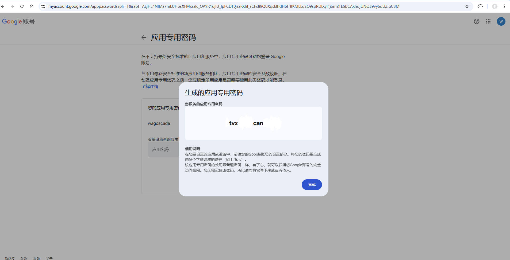
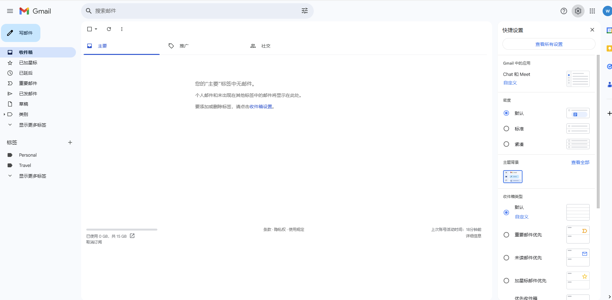
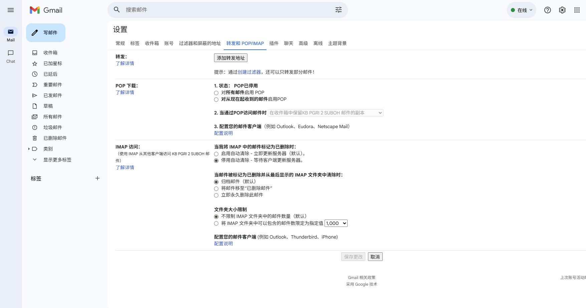
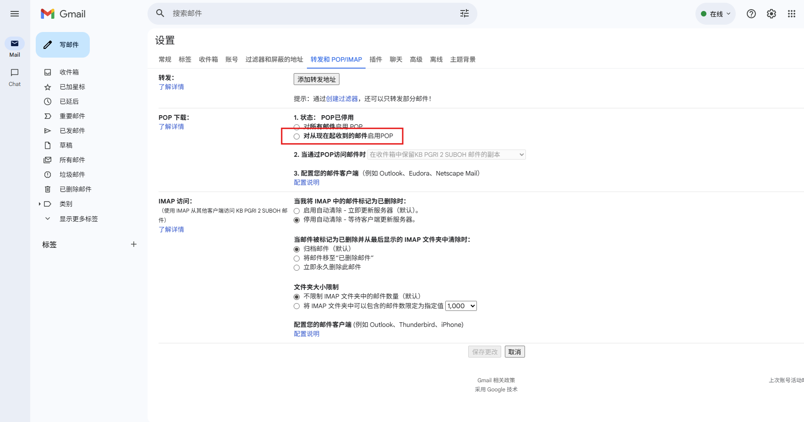

# Email(SMTP)

用来配置通过SMTP发送邮件报警通知。

#### 创建Email(SMTP)服务

1. 点击“**报警**”->"**报警通知**"->"**通知服务**"，进入通知服务列表页面。

2. 点击右上角“**新增**”按钮。在新增弹窗中选择Email(SMTP)。

3. 点击下一步，进入详细配置界面。

4. 设置完成，点击“测试连接“，测试邮件服务是否配置成功。
5. 测试成功后，点击'**确认**'按钮，添加该条配置数据。

**属性**

| **名称**     | **描述**                                      |
|:--------------|:-----------------------------------------------|
| 名称         | 通知服务名称。                                 |
| 描述         | 通知服务描述。                                 |
| 发件人地址   | 需要使用发送邮件功能的邮箱账号。               |
| SMTP 服务器  | 需要使用发送邮件功能的邮箱SMTP服务器地址。     |
| 安全链接     | SMTP服务器安全连接方式。                       |
| SMTP 端口    | SMTP服务器端口地址。                           |
| 用户名       | 登录SMTP服务器的用户名（通常是发件人邮箱账号）。 |
| 密码         | 登录SMTP服务器的密码（通常是发件人邮箱密码）。   |
| SMTP超时(ms) | 连接SMTP服务器超时时间。                       |
| 测试连接     | 点击该按钮，测试邮件服务是否配置成功。          |

###### GMAIL密码设置

Google的GMail为了安全，在授权第三方登录时需要使用应用程序专用密码。

使用专用密码的前提是，GMail账号需要开启两步验证。如果已经开启两步验证，可以直接开始创建专用密码步骤。

**开启两步验证**

1. 登录Google账号  [https://myaccount.google.com/](https://myaccount.google.com/)
2. 点击导航面板的 “安全性 “菜单。
3. 在安全性页面的 “您的 Google 账号登录选项“ 下方，开启两步验证。
4. 按照屏幕提示步骤操作。

**创建和使用应用专用密码 ** 

**重要提示：若要创建应用专用密码，您需要为 Google 账号开启两步验证**

1. 访问专用密码创建网址：  [https://myaccount.google.com/apppasswords](https://myaccount.google.com/apppasswords) 
2. 输入需要使用密码的应用程序名称，例如：WagoVC hub
3. 复制并保存专用密码。

如果打开应用专用密码创建页面出现以下情况，请参照上文开启**两步验证**后在重新打开该页面

**开启SMTP服务**

1. 在计算机上打开  [Gmail](https://mail.google.com/)。
2. 点击右上角的“设置”图标 ，查看所有设置。

    

3. 点击**转发和 POP/IMAP** 标签。

    

4. 在“POP 下载”部分，选择 **对从现在起收到的邮件启用POP。**

**测试账号密码**

在配置页面填写账号和对应密码（**GMail邮箱服务请填写上文创建的应用专用密码**）完毕后，点击“测试连接”按钮，测试账号密码是否正确。

#### 参考资料

 [Outlook.com 的 POP、IMAP 和 SMTP 设置 - Microsoft 支持](https://support.microsoft.com/zh-cn/office/outlook-com-%E7%9A%84-pop-imap-%E5%92%8C-smtp-%E8%AE%BE%E7%BD%AE-d088b986-291d-42b8-9564-9c414e2aa040)

 [IMAP、POP 和 SMTP  |  Gmail  |  Google for Developers](https://developers.google.cn/gmail/imap/imap-smtp?hl=zh-cn)

#### 通知服务应用

在报警的**通知规则**中将选择通知服务。

1. 点击“**报警**”->"**报警通知**"->"**通知规则**"，进入通知规则列表页面。
2. 点击列表右上角的“新增“按钮。
3. 在新增弹窗中点击通知的'**+Email**'按钮，新增一条Email通知规则，在通知服务选择之前创建好的通知服务。

    

