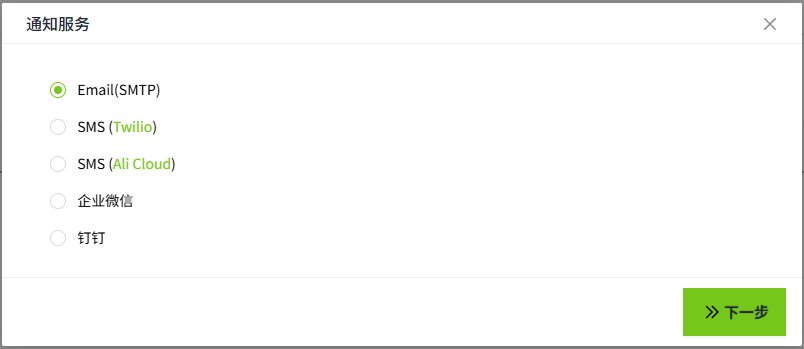

# Services

There are five types of alarm notification services in VC Hub.

- [Email(SMTP)](email.md) 
- [SMS(Twilio)](sms-twilio.md) 
- [SMS(Ali Cloud)](sms-alicloud.md) 
- [WeCom](wecom.md)
- [DingTalk](dingtalk.md) 

When a tag triggers an alarm, you can select the corresponding notification service based on the configured rule information to send alarm notifications to users.