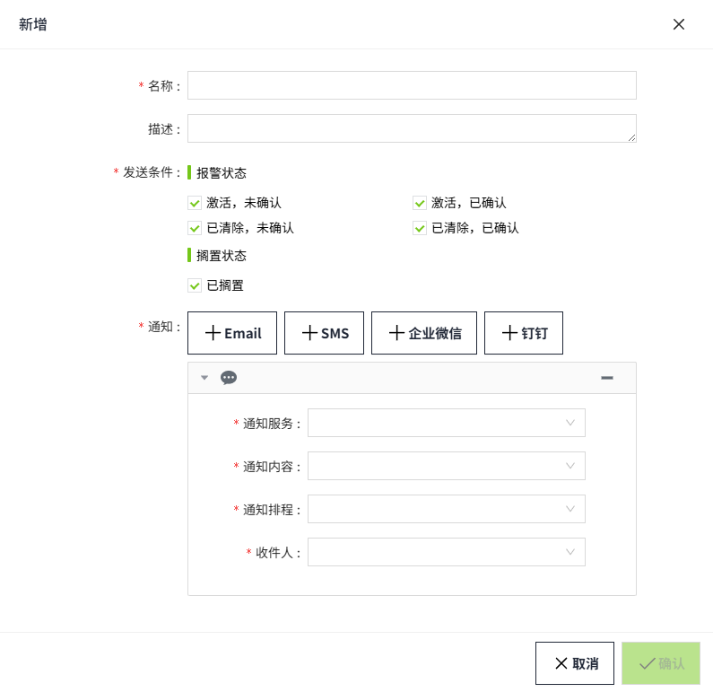

# SMS(Ali Cloud)

用来配置阿里云报警短信通知服务（推荐在中国使用）。通过此配置，可以配置对应的手机短信网络运营商。有关如何申请阿里云短信服务和价格的详细信息，请参阅此 [链接](https://www.aliyun.com/lowcode/promotion/dysms/supervalue?utm_content=se_1018926637)。

## 创建SMS(Ali Cloud)服务

1. 点击“**报警**”->"**报警通知**"->"**通知服务**"，进入通知服务列表页面。

    

2. 点击“**新增**”按钮。在新增弹窗中选择SMS(Ali Cloud)。

    

3. 点击"下一步"，进入详细配置界面。

    

4. 设置完成，点击"**确认**"按钮。

**属性**

| **名称**         | **描述**|
|:------------------|:------------------------------------------------------------------------------------------------------------------------------|
| 名称             | 通知服务名称。 |
| 描述             | 通知服务描述。|
| AccessKey ID     | 阿里云服务访问密钥标识（请在阿里云上进行申请）。|
| AccessKey Secret | 阿里云服务访问密钥标识密码（请在阿里云上进行申请）。|
| Endpoint         | [短信服务区域地址](https://help.aliyun.com/zh/ram/user-guide/create-an-accesskey-pair?spm=a2c4g.11186623.0.0.20632a50VhCDpf) |

## 参考资料

 [API服务接入点](https://help.aliyun.com/zh/sms/developer-reference/api-dysmsapi-2017-05-25-endpoint?spm=a2c4g.11186623.0.0.720a61a5DJ7hH2) [_](https://help.aliyun.com/zh/sms/developer-reference/api-dysmsapi-2017-05-25-endpoint?spm=a2c4g.11186623.0.0.720a61a5DJ7hH2) [短信服务(SMS)-阿里云帮助中心 (aliyun.com)](https://help.aliyun.com/zh/sms/developer-reference/api-dysmsapi-2017-05-25-endpoint?spm=a2c4g.11186623.0.0.720a61a5DJ7hH2)

 [创建阿里云AccessKey](https://help.aliyun.com/zh/ram/user-guide/create-an-accesskey-pair?spm=a2c4g.11186623.0.0.20632a50VhCDpf) [_](https://help.aliyun.com/zh/ram/user-guide/create-an-accesskey-pair?spm=a2c4g.11186623.0.0.20632a50VhCDpf) [访问控制(RAM)-阿里云帮助中心 (aliyun.com)](https://help.aliyun.com/zh/ram/user-guide/create-an-accesskey-pair?spm=a2c4g.11186623.0.0.20632a50VhCDpf)

## 通知服务应用

在报警的**通知规则**中将选择通知服务。

1. 点击“**报警**”->"**报警通知**"->"**通知规则**"，进入通知规则列表页面。
2. 点击列表右上角的“新增“按钮。
3. 在新增弹窗中点击通知的'**+SMS**'按钮，新增一个短信通知规则，在通知服务选择之前创建好的阿里短信通知服务。

    

