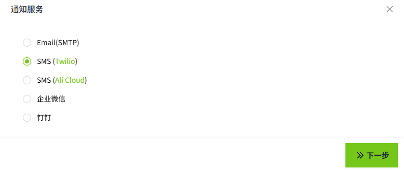
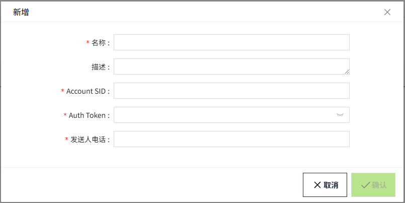

# SMS(Twilio)

用来配置短信报警通知服务（推荐国外使用）。通过此配置，可以配置对应的短信发送网络运营商。有关如何申请 Twilio 短信服务和价格的详细信息，请参阅此 [链接](https://www.twilio.com/en-us/messaging/channels/sms)。

## 创建SMS(Twilio)服务

1. 点击“**报警**”->"**报警通知**"->"**通知服务**"，进入通知服务列表页面。

    

2. 点击“**新增**”按钮。在新增弹窗中选择SMS(Twilio)。

    

3. 点击下一步，进入详细配置界面。

    

**属性**

| **名称**    | **描述**           |
|:-------------|:--------------------|
| 名称        | 通知服务名称       |
| 描述        | 通知服务描述       |
| Account SID | Twilio账号Id       |
| Auth Token  | 权限验证Token      |
| 发送人电话  | Twilio购买的手机号 |

## 参考资料

 [Communication APIs for SMS, Voice, Email & Authentication | Twilio](https://www.twilio.com/en-us)

 [Programmable Messaging | Twilio](https://www.twilio.com/docs/messaging)

## 通知服务应用

在报警的**通知规则**中将选择通知服务。

1. 点击“**报警**”->"**报警通知**"->"**通知规则**"，进入通知规则列表页面。
2. 点击列表右上角的“新增“按钮。
3. 在新增弹窗中点击通知的'**+SMS**'按钮，新增一个短信通知规则，在通知服务选择之前创建好的Twilio短信通知服务。

    

