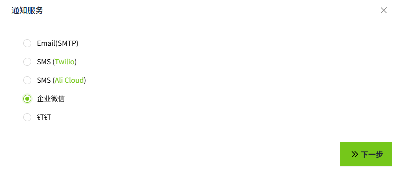
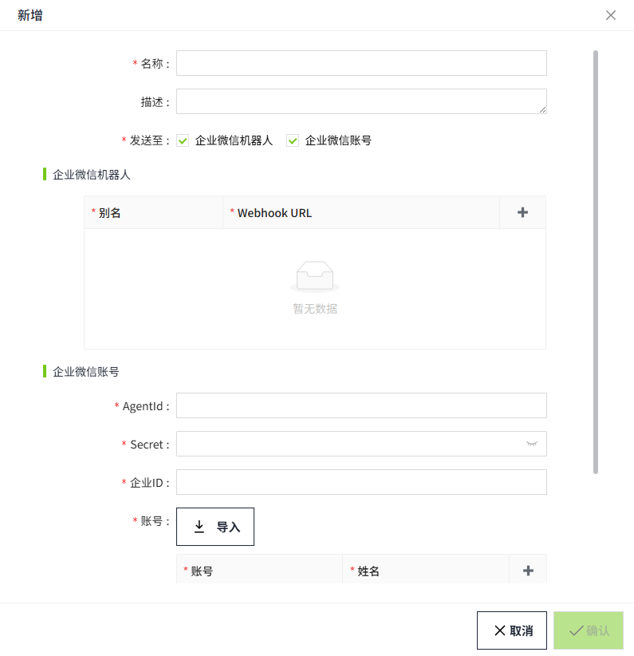
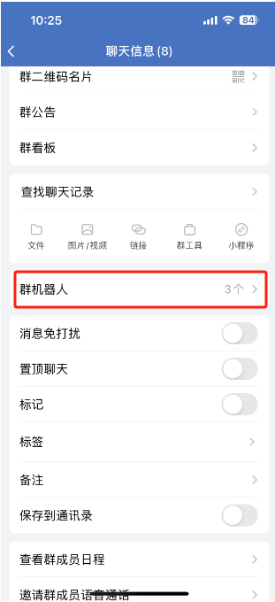
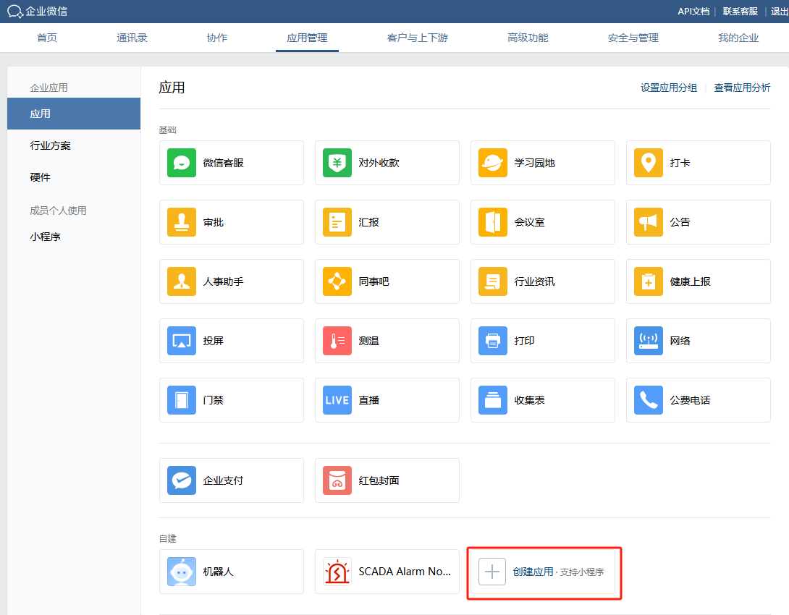
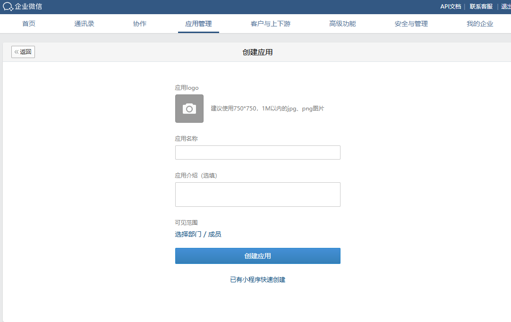

# 企业微信

用来配置通过企业微信给特定的群组或者账号发送报警通知。

#### 创建企业微信服务

1. 点击“**报警**”->"**报警通知**"->"**通知服务**"，进入通知服务列表页面。

    

1. 点击右上角“**新增**”按钮。在新增弹窗中选择企业微信。

    

2. 点击下一步，进入详细配置界面。

    

    “发送至”默认选择企业微信机器人，如果想发给个人，请勾选企业微信账号，两者允许同时选择。

    

3. 设置完成后，点击'**确认**'按钮，添加该条配置数据。

**属性**

| **名称**       | **描述**|
|:----------------|:-----------------------------------------------------------------------------------------------------------------------------------------------------------------------------------------------------------------------------------------------------------------------------------------------------------------------------------------------------------------------------------------------------------------------------------------------------------------------------------------------------------------------------------------------------------------------------------------------------------------------------------------------------------------------------------------------------------------------------------------------------------------------------------------------------------------------------------------------------------------------------------------------------------------------------------------------------------------------------------------------------------------------------------------------------------------------------------------------------------------------------------------------------------------------------------------------------------------------------------------------------------------------------------------------------------------------------------------------------------------------------------------------------------------------------------------------------------------------------------------------------------------------------------------------------------------------------------------------------------------------------------------------------------------------------------------------------------------------------------------------------------------------------------------------------------------------------------------------------------------------------------------------------------------------------------------------------------------------------------------------------------------------------------------------------------------------------------------------------------------------------------------------------------------------------------------------------------------------------------------------------------------------------------------------------------|
| 名称           | 通知服务名称。|
| 描述           | 通知服务描述。 |
| 发送至         | 您可以将接收方配置为企业微信群或企业微信单个账号。选择类型后，请在下方对应区域添加相关信息。   - **群组名称**：您可以输入多个群组名称，用 “&” 符号分隔。  - **Webhook 地址**：通知将通过每个群组机器人的唯一 Webhook URL 发送。一个机器人可以添加到多个群聊中——当触发警报时，机器人会将通知推送至其所属的每个群组，无论该群组名称是否已在配置中明确列出。|
| 企业微信机器人 | 当 “发送到” 设置为 “企业微信群” 时，将显示此配置区域，用于指定应接收警报通知的企业微信群。   - **群名称**：企业微信群组的确切名称（应与 WeC企业微信中的群组名称完全一致）。  - **群机器人 Webhook 地址**：在企业微信群中配置机器人时自动生成的 HTTP 端点。使用此地址向该群发送通知。Webhook 地址通常采用以下形式：*https://qyapi.weixin.qq.com/cgi-bin/webhook/send?key=......*   - `qyapi.weixin.qq.com`：企业微信对外开放的 API 域名  - `/cgi-bin/webhook/send`：机器人消息推送的固定路径  - `key=…`：每个机器人独一无二的身份凭证，创建机器人时系统会自动生成 |
| 企业微信账号   | 当 “发送到” 设置为 “企业微信账号” 时，将显示此配置区域。该区域用于指定应接收警报通知的企业微信账号。   若想将通知发给个人，需在先在微信管理后台 → “应用管理” 页面创建一个应用，通过该应用来进行通知发送。    **AgentId**  应用的唯一标识。  在企业微信管理后台 → “应用管理” 页面，点击你创建的应用，在应用详情页可见“AgentId”。    **Secret**  配合企业ID 与 AgentId，用于调用 API 时的身份验证。  在企业微信管理后台 → “应用管理” 页，点击你创建的应用，在应用详情页可见“Secret”。     **企业ID**   企业微信组织的唯一标识。  在企业微信管理后台 → “我的企业” 页面内可见。     **账号**  设置接收报警通知的企业微信账号。账号需和企业微信管理后台 → “通讯录” 中的账号一致。  如果想通过导入的方式添加账号，需在企业微信管理后台，导出账号。   |

## 如何添加群机器人

**桌面端**

1. 点击一个企业微信群的设置按钮，选择“添加群机器人”。

    

2. 创建一个机器人

    

3. 保存机器人

    

**手机端**

1. 进入一个企业微信群，点击右上角的设置按钮

    

2. 点击后进入聊天信息页面，在该页面点击群机器人

    

3. 在群机器人窗口，点击页面右上角的“添加”按钮，按照添加步骤，添加机器人即可。

#### 如何查看群机器人Webhook地址

**桌面端**

在企业微信群内，点击某个群机器人，即可查看该机器人的Webhook地址。

**手机端**

1. 在企业微信群内，点击右上角的设置按钮进入聊天信息页面
2. 在聊天信息页面点击群机器人，进入群机器人列表
3. 在列表中，点击群机器人，即可查看

    
     **说明**：只有自己创建的群机器人，才能查看到Webhook地址。

#### 如何创建应用

1. 登录企业微信管理后台(  [https://work.weixin.qq.com/wework_admin/frame#apps](https://work.weixin.qq.com/wework_admin/frame#apps) )，在“应⽤管理“页面点击**创建应用**

    

2. 创建一个应用。

    **说明**：可见范围一定要设置，选择需要接收报警通知的部门或者成员。

    

3. 应用创建完成后，在该应用页面底部点击”企业可信IP“的配置按钮

    

    设置可信域名或者设置接受消息服务器URL

    

4. 设置可信域名完毕后，配置企业可信IP

    

5. 完成配置。

## 通知服务应用

在报警的**通知规则**中将选择通知服务。

1. 点击“**报警**”->"**报警通知**"->"**通知规则**"，进入通知规则列表页面。
2. 点击列表右上角的“新增“按钮。
3. 在新增弹窗中点击通知的'**+企业微信**'按钮，新增一条Email通知规则，在通知服务选择之前创建好的通知服务。

    