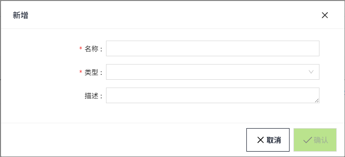

# 报警历史库

WAGO VC Hub允许您将报警数据存储到数据库中。可以存储有关已发生的警报的基本数据，例如路径、时间、等级、状态等。

可以创建多个历史库，可以将一部分报警存储在一个数据库中，而将另一部分报警存储在另一个数据库中。并为每个库设置不同的存储策略。

在历史报警控件上，可以选择历史库进行数据筛选。

## 创建历史库

1. 点击“报警”->"历史库"，进入历史库列表页面。

    

2. 点击“新增”按钮。在新增弹窗中进行属性设置。

    

    类型选择”数据库”时，显示如下内容：

    

    **弹窗属性表**

    | **名称**   | **描述** |
    |:------------|:-------------------------------------------------------------------------------------------------------------------------------------------------------------------|
    | 名称       | 报警历史库的名称。|
    | 类型       | 下拉选择，包含：数据库和远程。当类型选择数据库时，在数据库连接字段中，选择一个本地创建的数据库。当选择远程时，需选择远端节点以及远端报警历史库。|
    | 数据库连接 | 下拉选择在“数据库”->“数据库连接”页面已经建立的数据库。只能单选。  | 说明：下拉选项中不包括类型为InfluxDB的数据库。 | |----------------------------------------------| |
    | 描述       | 报警历史库的描述。|
    | 保留天数   | 此报警历史库下的报警数据在数据库中的保留天数。|
    | 最低优先级 | 设置存储哪些等级的报警数据。仅存储等于或高级指定优先级的报警。|

    类型选择”远程”时，显示如下内容：

    

    **弹窗属性表**

    | **名称**       | **描述** |
    |:----------------|:-----------------------------------------------------------------------------------------------------------------------------------------------------------------|
    | 名称           | 报警历史库的名称。|
    | 类型           | 下拉选择，包含：数据库和远程。当类型选择数据库时，在数据库连接字段中，选择一个本地创建的数据库。当选择远程时，需选择远端节点以及远端报警历史库。                        |
    | 远端节点       | 下拉选择一个和当前节点形成组网的节点名称。|
    | 远端报警历史库 | 根据所选的远端节点，显示该节点下创建的报警历史库。|
    | 仅查询         | 默认不开启。开启后，只能查询远端报警，远端新产生的报警不会存到数据库中；如果不开启，会将远端新产生的报警存到数据库中。此处所说的数据库是指远端报警历史库使用的数据库。 |
    | 描述           | 报警历史库的描述。|

3. 设置完成，点击确认按钮。

## 历史库应用

在历史报警控件的筛选条件中选择历史库，接下来将在所选的历史库中进行数据筛选。

