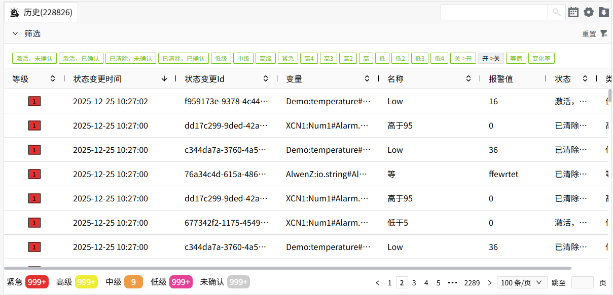

# 报警

报警用于监控和通知系统中出现的异常情况。在变量上配置，如果变量的最新值满足已设置的报警条件时，则生成新的报警。

#### 报警类型

支持以下报警类型：

- 限值报警：当变量值满足设置的限值条件时产生报警。WAGO VC Hub 内置了8个限值，4个高限，4个低限。您可以同时设置多个限值条件。当变量值满足多个限值条件时，会针对每个限值触发一个报警。

 举例：温度上限值为20，温度上上限值为40，当前变量值为50，则该变量会生成2条限值报警，一条温度上限的报警和一条温度上上限的报警。

- 变化速率报警：当变量值的变化速率超过设置的变化率时产生报警。
- 等值报警：当变量值等于预设的报警值时产生报警。
- 开关量报警：当布尔量的状态发生变化时产生报警。例如从true变为false时产生报警。

#### 报警优先级

WAGO VC Hub内置了4个报警等级。通过报警等级可以对报警进行分类，便于快速识别和响应。

- 紧急
- 高级
- 中级
- 低级

#### 报警状态

报警状态由活动状态和确认状态组成。

- 激活，未确认
- 激活，已确认
- 已清除，未确认
- 已清除，已确认

##### 活动状态

所有报警都从“活动”状态开始，然后到“已清除”状态结束。

- 激活：当前正在报警。
- 已清除：由报警状态恢复到正常值，不再满足设置的报警条件。

##### 确认状态

可以对已产生的报警进行确认。确认只是一个标志，表明相关人员已经知晓并会处理该报警。

- 未确认：报警尚未标记为“已确认”。
- 已确认： 报警已标记为“已确认”。

##### 报警确认方式

- 自动确认：报警产生后，如果之后 又恢复正常值 ，系统自动确认此条报警。自动确认后该条报警从实时报警控件中消失。但是自动确认的报警，也可以在报警恢复正常前，随时进行手工确认。
- 手动（需 确认） ：报警产生后，必须 人工手动确认，且确认时需要输入确认信息。
- 手动（无需 确认） ：报警产生后，必须 人工手动确认，无需输入确认信息。

**说明**：需要手动确认的报警，在未确认前， 即便当前报警值 已恢复至 正常值 ，也不会从实时报警控件中消失。

#### 报警搁置

搁置可用于在一段时间内暂时忽略警报，例如维护期。

搁置是对已选的报警路径下的报警进行忽略，防止其创建新的报警。按照报警 路径进行搁置，相同路径的多个 报警数据，勾选其中一条进行 搁置，其他相同路径的所有 报警会一起被搁置，且 在搁置列表中只会显示为一条数据。

每个搁置的报警都需设置搁置时长。在搁置期结束时，会判断该条报警的最新值，从而显示该条报警的报警状态。

此外，被搁置的报警将从实时报警控件的”实时“列表中消失，显示在”搁置“列表中。

#### 报警死区

 报警死区的作用主要是针对测量值达到报警条件后的容差，防止由于测量值在阈值附近微小波动，导致不必要的报警信息产生。

 死区配置只对报警恢复那侧 增加了限制 ，对于报警产生不做限制 。

 比如设置一个 >=50 就要报警的限值报警，死区设置为 1 。那么只要 >=50 时就会产生报警，但是要到 <50-1 报警才会消失。当然如果报警方向反过来，设置一个 <=50 就要报警的限值报警，死区设置也为 1 ，那么只要 <=50 就产生报警，但是要到 >50+1 的时候报警才会消失。

#### 报警延时

 报警延迟的作用主要是针对变量 值到达报警条件后的瞬时波动或噪声，防止报警只是瞬间的，而不是持续的，所以需要等待一段时间。

 所有的类型的报警都有延迟报警配置，包括开关量类型的报警。

 延迟报警配置分为激活延迟和恢复延迟，单位为秒。

 激活延迟是指当报警条件达到时，不是立马就产生报警，而是经过一定时间后，如果报警还是满足产生条件，才产生这个报警。反之，恢复延迟是指当报警达到恢复条件时，不是立马恢复报警，而是需要等待一定时间到达后，如果报警依然满足恢复条件，才恢复报警。

#### 配置报警

在变量上配置报警。详见[报警](../assets-and-tags/tag/tag-properties/alarm.md)。

变量开启了报警配置后，在变量树中会显示对应的图表，您可以快速辨别出哪些变量开启了报警配置。

#### 查看实时报警数据

可以使用[实时报警](../../2d-visualization/controls/alarm/real-time-alarm/index.md)控件进行报警数据的查看。

#### 查看历史报警数据

可以使用[known-link]控件进行报警数据的查看。

