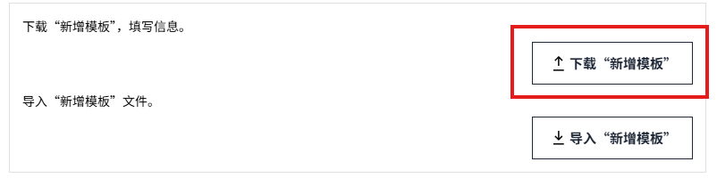
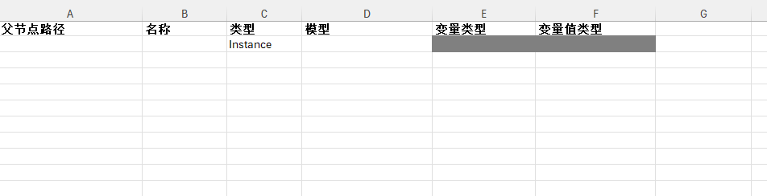
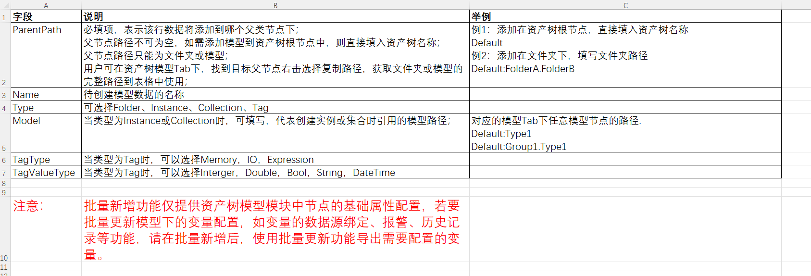
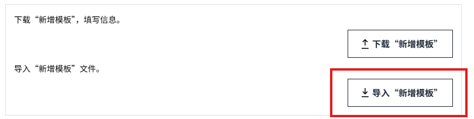

# 批量新增

在 **实例** 和 **模型** 选项卡中，均可进行批量新增操作，批量新增时仅新增 **基本信息**，之后通过“**批量更新**”完成变量的详细设置。

## 下载“新增模板”

1. 在”实例”或者”模型”选项卡中，点击更多按钮，点击批量操作。

    

    

2. 在 **批量操作** 弹窗中，点击 **下载“新增模板”**，将在浏览器端下载一份空的批量新增的Excel模板，用户在模板中填写所需信息。

    

#### “新模板”介绍

批量新增的Excel模板中包含两个Sheet：**Sheet0** 和 **重要说明**。

- Sheet0用于新增数据.
- 重要说明中说明了如何使用模板创建数据。

模型和实例的新增模板中字段相同，唯一的区别在于可选类型不同。

- 在实例的新增模板中，类型包含：Folder，Instance，Tag；
- 在模型的新增模板中，类型包含：Folder，Model,  Instance，Collection,  Tag。

在”重要说明”的Sheet中，用户可查看Sheet0中说明和举例的每列字段的描述，以辅助用户完成填写。

**模型新增模板说明：**

**实例新增模板说明：**

## 导入“新增模板”

模板编辑完成后，点击 **导入“新增模板”** 按钮，将新增信息进行导入。

